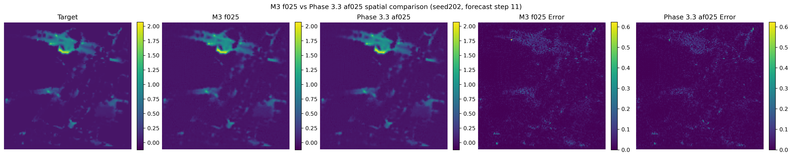
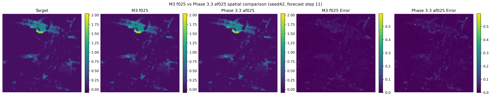
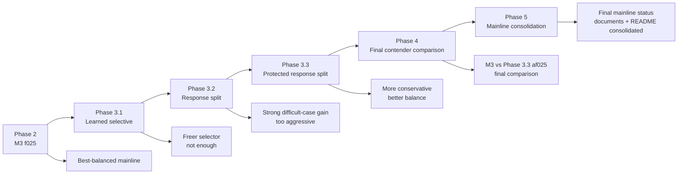
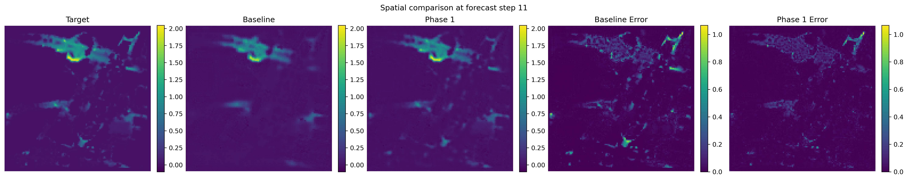
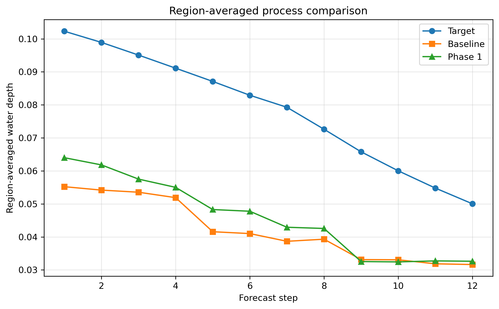
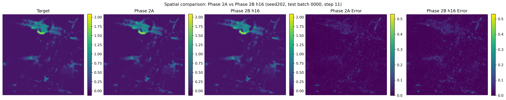
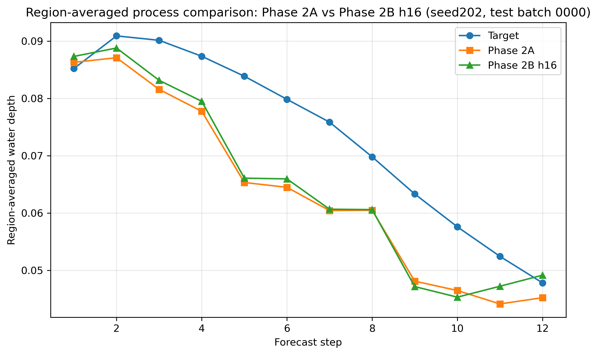
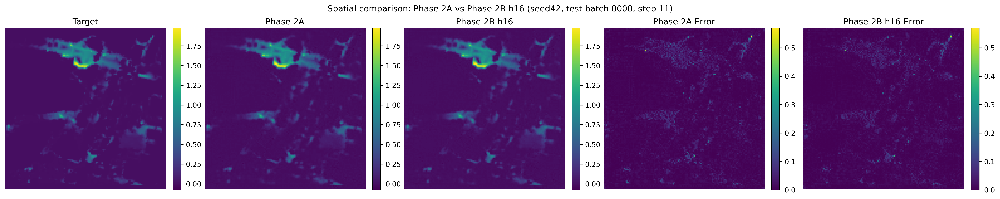
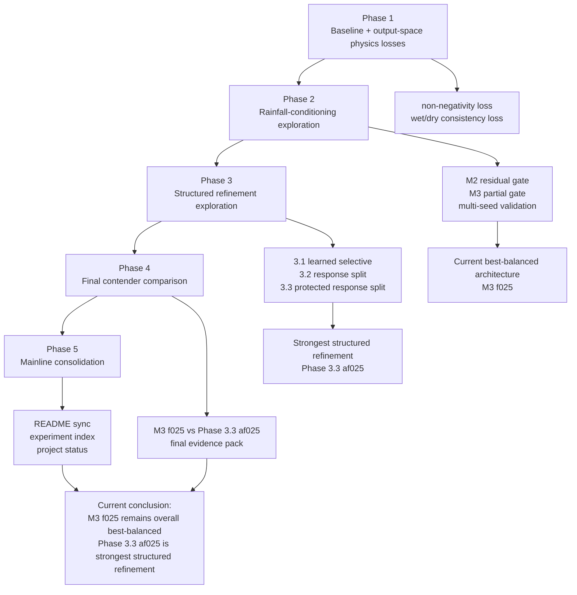

# Physics-Guided Urban Flood Process Prediction

A research prototype for physics-guided urban flood process prediction based on a U-Net + TCN framework, with staged exploration of physics-guided losses and structured rainfall-conditioning architectures.

## Current Project Status

### Current best-balanced architecture

The current best-balanced architecture is:

`temporal_gate_residual_partial`  
`hidden_channels = 16`  
`residual_alpha = 0.10`  
`conditioned_fraction = 0.25`

This corresponds to the current **M3 f025** direction.

### Current best structured refinement direction

The strongest structured refinement discovered so far is:

`temporal_gate_residual_response_split_protected`  
`hidden_channels = 16`  
`residual_alpha = 0.10`  
`conditioned_fraction = 0.25`  
`active_fraction_within_response = 0.25`

This is the final best Phase 3 variant, but it does **not yet surpass** M3 f025 as the overall best-balanced architecture.

## Quick Results Snapshot

| Variant | Seed202 RMSE | Seed202 MAE | Seed202 IoU | Seed42 RMSE | Seed42 MAE | Seed42 IoU | Role |
|---|---:|---:|---:|---:|---:|---:|---|
| M3 f025 | 0.040568 | 0.016056 | 0.795732 | 0.035211 | 0.013695 | 0.830558 | Current best-balanced |
| Phase 3.3 af025 | 0.039514 | 0.015807 | 0.801322 | 0.038861 | 0.014598 | 0.800325 | Best structured refinement |

Interpretation:

- M3 f025 remains the overall best-balanced architecture.
- Phase 3.3 af025 is the strongest structured refinement discovered so far.
- Phase 3.3 af025 improves over M3 on the difficult case (`seed202`), but still does not surpass M3 on the favorable case (`seed42`).

## Phase 4 Final Comparison

Phase 4 completed the final contender comparison between the two strongest project-level directions:

- **M3 f025** — current best-balanced mainline
- **Phase 3.3 af025** — strongest structured refinement

Key takeaway:
- **seed202** is the difficult case, where Phase 3.3 af025 performs better overall.
- **seed42** is the favorable case, where M3 f025 remains stronger.
- At the project level, **M3 f025 remains the current best-balanced architecture**, while **Phase 3.3 af025 remains the strongest structured refinement discovered so far**.

For the full Phase 4 comparison note, see:
- [`docs/phase4_final_comparison.md`](docs/phase4_final_comparison.md)

### Final spatial comparison on difficult case (`seed202`)



### Final spatial comparison on favorable case (`seed42`)




## Stage Evolution



## Qualitative Examples

### Baseline vs Phase 1

#### Spatial Inundation Comparison



#### Region-Averaged Process Comparison



### Phase 2A vs Phase 2B h16 on Difficult Case (`seed202`)

#### Spatial Inundation Comparison



#### Region-Averaged Process Comparison



## More Qualitative Figures

<details>
<summary>Expand additional favorable-case comparisons</summary>

### Phase 2A vs Phase 2B h16 on Favorable Case (`seed42`)

#### Spatial Inundation Comparison



#### Region-Averaged Process Comparison


</details>


## Research Roadmap



### Summary

- Phase 1 established the output-space physics-guided baseline.
- Phase 2 identified **M3 f025** as the current best-balanced architecture.
- Phase 3 explored more structured modulation designs and identified **Phase 3.3 af025** as the strongest structured refinement.
- Phase 4 completed the final contender comparison between **M3 f025** and **Phase 3.3 af025**.
- Phase 5 consolidated the final conclusions, documentation, and mainline presentation.
- The overall best-balanced architecture still remains **M3 f025**.

## Branch Guide

The repository uses branch-based stage archives.

### Main branches

- `main`  
  Stable presentation branch for the current project summary and entry point.

- `phase2b-m3-partial-gate`  
  Archive of the M3 partial-gate exploration and Phase 2 best-balanced direction.

- `phase3-structured-selective-modulation`  
  Archive of Phase 3.1 learned-selective exploration.

- `phase3-2-structured-response-split`  
  Archive of Phase 3.2 response-split exploration.

- `phase3-3-protected-response-split`  
  Archive of final Phase 3 protected response-split exploration and Phase 3 summary.

## Repository Structure

```text
configs/
datasets/
docs/
models/
scripts/
trainers/
utils/
compare_maps.py
compare_timeseries.py
README.md
```

## Dataset

This project uses the UrbanFlood24 Lite dataset.

Expected dataset directory:

```text
data/
└─ urbanflood24_lite/
   ├─ train/
   └─ test/
```

The dataset contains:

- dynamic flood depth sequences
- rainfall forcing sequences
- static geospatial factors:
  - `absolute_DEM.npy`
  - `impervious.npy`
  - `manhole.npy`

## Task Definition

The task is multi-step flood process prediction.

### Inputs

- past flood sequence
- past rainfall sequence
- future rainfall sequence
- static maps

### Output

- future flood depth sequence

Current setup:

`input_steps = 12`  
`pred_steps = 12`

## Model Backbone

The common forecasting backbone is based on:

- U-Net spatial encoder-decoder
- TCN temporal module
- rainfall-conditioned temporal modulation variants

## Environment

Recommended environment:

```bash
conda create -n urnn python=3.10 -y
conda activate urnn
pip install -r requirements.txt
```

## Training

Example:

```bash
python scripts/train_model.py --config <your_config>.json
```

## Evaluation

Example:

```bash
python scripts/evaluate_model.py --config <your_config>.json
```

## Visualization

Example scripts:

```bash
python compare_maps.py
python compare_timeseries.py
```

## Key Project-Level Conclusions

1. Lightweight output-space physics guidance improves over the pure baseline.
2. Residual partial rainfall gating (**M3 f025**) is currently the overall best-balanced architecture direction.
3. Structured response-split ideas are meaningful, especially for difficult cases.
4. Protected response split (**Phase 3.3 af025**) is the strongest structured refinement discovered so far.
5. Phase 4 completed the final contender comparison between **M3 f025** and **Phase 3.3 af025**.
6. Phase 5 completed the consolidation of the mainline README, documentation index, and project status materials.
7. The current mainline project conclusion remains:
   - **M3 f025** = current overall best-balanced architecture
   - **Phase 3.3 af025** = strongest structured refinement

## Documentation

Detailed experimental notes are stored in `docs/`, including:

- Phase 2 multi-seed summaries
- Phase 2 qualitative comparison notes
- M2 and M3 archive notes
- Phase 3.1 notes
- Phase 3.2 notes
- Phase 3.3 notes
- overall `phase3_summary.md`
- `phase4_final_comparison.md` — final direct comparison between M3 f025 and Phase 3.3 af025

## License

MIT