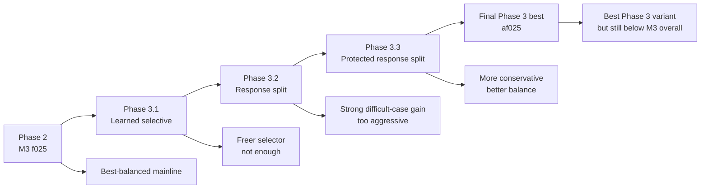

# Physics-Guided Urban Flood Process Prediction

A research prototype for physics-guided urban flood process prediction based on a U-Net + TCN framework, with staged exploration of physics-guided losses and structured rainfall-conditioning architectures.

## Current Project Status

### Current best-balanced architecture

The current best-balanced architecture is:

`temporal_gate_residual_partial`  
`hidden_channels = 16`  
`residual_alpha = 0.10`  
`conditioned_fraction = 0.25`

This corresponds to the current **M3 f025** direction.

### Current best structured refinement direction

The strongest structured refinement discovered so far is:

`temporal_gate_residual_response_split_protected`  
`hidden_channels = 16`  
`residual_alpha = 0.10`  
`conditioned_fraction = 0.25`  
`active_fraction_within_response = 0.25`

This is the final best Phase 3 variant, but it does **not yet surpass** M3 f025 as the overall best-balanced architecture.

## Quick Results Snapshot

| Variant | Seed202 RMSE | Seed202 MAE | Seed202 IoU | Seed42 RMSE | Seed42 MAE | Seed42 IoU | Role |
|---|---:|---:|---:|---:|---:|---:|---|
| M3 f025 | 0.040568 | 0.016056 | 0.795732 | 0.035211 | 0.013695 | 0.830558 | Current best-balanced |
| Phase 3.3 af025 | 0.039514 | 0.015807 | 0.801322 | 0.038861 | 0.014598 | 0.800325 | Best structured refinement |

Interpretation:

- M3 f025 remains the overall best-balanced architecture.
- Phase 3.3 af025 is the strongest structured refinement discovered so far.
- Phase 3.3 af025 improves over M3 on the difficult case (`seed202`), but still does not surpass M3 on the favorable case (`seed42`).

## Stage Evolution



## Research Roadmap

### Phase 1
Baseline + output-space physics-guided losses:
- non-negativity loss
- wet/dry consistency loss

### Phase 2
Rainfall-conditioning architecture exploration:
- residual gate variants
- partial gate variants
- multi-seed validation
- identification of current best-balanced direction: **M3 f025**

### Phase 3
Structured rainfall-conditioning exploration:
- Phase 3.1: learned selective modulation
- Phase 3.2: response split
- Phase 3.3: protected response split

Final Phase 3 conclusion:
- free learned channel selection is not the main answer
- structured memory/response separation is meaningful
- protected and conservative response modulation is the strongest structured refinement direction
- but M3 f025 remains the current global best-balanced architecture

## Branch Guide

The repository uses branch-based stage archives.

### Main branches

- `main`  
  Stable presentation branch for the current project summary and entry point.

- `phase2b-m3-partial-gate`  
  Archive of the M3 partial-gate exploration and Phase 2 best-balanced direction.

- `phase3-structured-selective-modulation`  
  Archive of Phase 3.1 learned-selective exploration.

- `phase3-2-structured-response-split`  
  Archive of Phase 3.2 response-split exploration.

- `phase3-3-protected-response-split`  
  Archive of final Phase 3 protected response-split exploration and Phase 3 summary.

## Repository Structure

```text
configs/
datasets/
docs/
models/
scripts/
trainers/
utils/
compare_maps.py
compare_timeseries.py
README.md
```

## Dataset

This project uses the UrbanFlood24 Lite dataset.

Expected dataset directory:

```text
data/
└─ urbanflood24_lite/
   ├─ train/
   └─ test/
```

The dataset contains:

- dynamic flood depth sequences
- rainfall forcing sequences
- static geospatial factors:
  - `absolute_DEM.npy`
  - `impervious.npy`
  - `manhole.npy`

## Task Definition

The task is multi-step flood process prediction.

### Inputs

- past flood sequence
- past rainfall sequence
- future rainfall sequence
- static maps

### Output

- future flood depth sequence

Current setup:

`input_steps = 12`  
`pred_steps = 12`

## Model Backbone

The common forecasting backbone is based on:

- U-Net spatial encoder-decoder
- TCN temporal module
- rainfall-conditioned temporal modulation variants

## Environment

Recommended environment:

```bash
conda create -n urnn python=3.10 -y
conda activate urnn
pip install -r requirements.txt
```

## Training

Example:

```bash
python scripts/train_model.py --config <your_config>.json
```

## Evaluation

Example:

```bash
python scripts/evaluate_model.py --config <your_config>.json
```

## Visualization

Example scripts:

```bash
python compare_maps.py
python compare_timeseries.py
```

## Key Project-Level Conclusions

1. Lightweight output-space physics guidance improves over the pure baseline.
2. Residual partial rainfall gating is currently the best-balanced architecture direction.
3. Structured response-split ideas are meaningful, especially for difficult cases.
4. Protected response split is the strongest structured refinement discovered so far.
5. However, no Phase 3 structured variant has yet fully surpassed M3 f025 as the overall best-balanced solution.

## Documentation

Detailed experimental notes are stored in `docs/`, including:

- Phase 2 multi-seed summaries
- Phase 2 qualitative comparison notes
- M2 and M3 archive notes
- Phase 3.1 notes
- Phase 3.2 notes
- Phase 3.3 notes
- overall `phase3_summary.md`

## License

MIT