# Physics-Guided Urban Flood Process Prediction

A research prototype for physics-guided urban flood process prediction based on a U-Net + TCN framework.

## Method Diagram

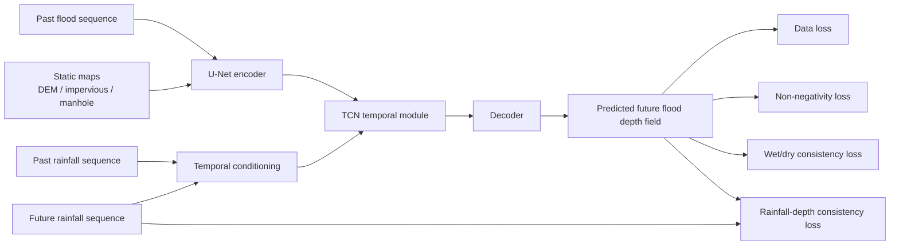
```mermaid
flowchart LR
    A[Past flood sequence] --> B[U-Net encoder]
    C[Past rainfall sequence] --> D[Temporal conditioning]
    E[Future rainfall sequence] --> D
    F[Static maps<br/>DEM / impervious / manhole] --> B

    B --> G[TCN temporal module]
    D --> G
    G --> H[Decoder]
    H --> I[Predicted future flood depth field]

    I --> J[Data loss]
    I --> K[Non-negativity loss]
    I --> L[Wet/dry consistency loss]
    I --> M[Rainfall-depth consistency loss]
    E --> M
```

## Stage Evolution


```mermaid
flowchart LR
    A[Phase 2<br/>M3 f025] --> B[Phase 3.1<br/>Learned selective]
    B --> C[Phase 3.2<br/>Response split]
    C --> D[Phase 3.3<br/>Protected response split]
    D --> E[Phase 6<br/>Adaptive pilot adapt025]
    E --> F[Phase 7<br/>Conservative adaptive adapt010]
    F --> G[Phase 8 Batch 2<br/>Trade-off positioning]
    G --> H[Phase 9<br/>Interpretability diagnosis]
    H --> I[Phase 10<br/>Margin-aware refinement]
    I --> J[Phase 12<br/>Reliability diagnosis]
    J --> K[Phase 13<br/>Failure-case visual summary]
    K --> L[Phase 14<br/>Confidence proxy diagnosis]
    L --> M[Phase 15<br/>Reliability screening and risk mapping]
    M --> N[Phase 16<br/>Warning rules and applicability boundary]
    N --> O[Phase 17<br/>Reliability-aware framework synthesis]
    O --> P[Phase 18<br/>Manuscript warning-layer writing]
    P --> Q[Phase 19<br/>Manuscript structure consolidation]
    Q --> R[Phase 20<br/>Manuscript draft assembly]
    R --> S[Phase 21<br/>Evidence and figure/table alignment]
    S --> T[Phase 22<br/>Full manuscript draft expansion]
    T --> U[Phase 23<br/>Reliability-aware warning case study]
    U --> V[Phase 24<br/>Physical consistency diagnostics]
    V --> W[Phase 25<br/>Target-wet recall consistency]
    W --> X[Phase 26<br/>Strong physics feasibility]

    A --> A1[Best-balanced mainline]
    B --> B1[Freer selector<br/>not enough]
    C --> C1[Strong difficult-case gain<br/>too aggressive]
    D --> D1[Strongest static structured refinement]
    E --> E1[Technically stable<br/>but not ultimately superior]
    F --> F1[Active adaptive candidate before margin-aware refinement]
    G --> G1[RMSE/MAE gains positioned<br/>mixed IoU diagnosed]
    H --> H1[Margin-region wet/dry trade-off identified]
    I --> I1[Boundary-band refinement confirmed<br/>seed123 / seed42 / seed202]
    J --> J1[Reliability boundaries diagnosed<br/>boundary / depth / scenario failure modes]
    K --> K1[Top failures visualized<br/>location2 repeated failure modes]
    L --> L1[Confidence proxies diagnosed<br/>not calibrated uncertainty]
    M --> M1[Deterministic screening labels<br/>scenario and pixel risk maps]
    N --> N1[Warning-rule guidance<br/>deterministic operational labels]
    O --> O1[Phase 12-16 synthesized<br/>manuscript and positioning narrative]
    P --> P1[Manuscript-ready warning-layer section<br/>based on Phase 12-17]
    Q --> Q1[Paper-ready outline and submission planning<br/>based on Phase 12-18]
    R --> R1[First full manuscript draft skeleton<br/>based on Phase 18-19]
    S --> S1[Claim-to-evidence alignment<br/>using existing outputs and figures]
    T --> T1[Full academic draft expansion<br/>based on Phase 20-21]
    U --> U1[Representative warning prototype<br/>using Phase 15, Phase 16, and Phase 10 map arrays]
    V --> V1[Physical consistency risk linkage<br/>false-dry / contraction / peaks / connectivity / volume]
    W --> W1[Diagnosis-driven refinement<br/>target-wet recall and wet-region preservation]
    X --> X1[Level 4 conservation-proxy supported<br/>Level 5 SWE/PINN not supported]
```


## Overview

This repository implements a spatiotemporal urban flood forecasting prototype using the UrbanFlood24 Lite dataset.  
The baseline model is built on a U-Net + TCN architecture for multi-step flood process prediction.

On top of the baseline, a Phase 1 physics-guided model is implemented by adding two output-space regularization terms:

- Non-negativity loss
- Wet/dry consistency loss

These physics-guided losses are imposed on the predicted future flood depth field at the output layer, while the backbone architecture remains unchanged.

## Current Mainline

The current overall best-balanced architecture reference is:

- `temporal_gate_residual_partial`
- `hidden_channels = 16`
- `residual_alpha = 0.10`
- `conditioned_fraction = 0.25`

This configuration remains the M3 `f025` mainline reference.

The strongest static structured refinement discovered so far is:

- `temporal_gate_residual_response_split_protected`
- `hidden_channels = 16`
- `residual_alpha = 0.10`
- `conditioned_fraction = 0.25`
- `active_fraction_within_response = 0.25`

This configuration remains the Phase 3.3 `af025` static reference.

Phase 6 Pilot A added an optional bounded adaptive scalar on top of the protected response-split path. The mechanism was technically stable, but the `adapt025` setting did not beat the static Phase 3.3 `af025` control in final validation, so it is treated as a documented negative/neutral adaptive result.

Phase 7 and Phase 8 established the more conservative `adapt010` setting as the active adaptive candidate before margin-aware refinement. It showed consistent RMSE, MAE, and loss gains across the required full `40e` comparisons, but Phase 8 also exposed a mixed wet/dry IoU trade-off, mainly through `seed123`.

Phase 9 diagnosed that trade-off as a mixed, margin-region, step-dependent wet/dry issue rather than adaptive multiplier saturation or seed-specific mechanism instability.

Phase 10 introduced a minimal diagnosis-driven intervention: boundary-band weighted wet/dry consistency refinement. The recommended Phase 10 setting is:

- `boundary_band_pixels = 1`
- `boundary_weight = 2.0`

This setting passed test-facing confirmation across the three key seeds:

- `seed123`: original mixed-IoU problem seed
- `seed42`: favorable-case guardrail seed
- `seed202`: difficult-case confirmation seed

`boundary_weight = 1.5` remains only a conservative rollback setting. No broader Phase 10 boundary-weight sweep is justified at this point.

Phase 12 then diagnosed the reliability and applicability boundaries of this recommended model using saved test-facing forecast maps. The first-pass diagnosis generated timestep-wise, depth-bin, boundary-distance, scenario-level, failure-case, and figure-based outputs under `analysis/phase12_reliability/`.

The main Phase 12 finding is that the model is useful for rapid spatiotemporal flood-process approximation, but reliability is not uniform. Exact wet/dry boundary cells remain the main bottleneck, moderate-to-deep target depths show stronger underprediction, and high-intensity `location2` cases dominate the highest-ranked failures.

Phase 15 converts the Phase 12/13/14 diagnostic evidence into a functional reliability-screening and spatial risk-mapping layer. It does not retrain models, modify architecture, modify the Phase 10 loss, tune `boundary_weight` or `boundary_band_pixels`, or start a new sweep.

Phase 16 converts the Phase 15 deterministic reliability-screening labels into application-oriented warning-rule guidance and an applicability boundary summary. The project progression is now:

```text
rapid prediction + reliability screening + spatial risk mapping
becomes
rapid prediction + reliability screening + spatial risk mapping + warning-rule guidance
```

Phase 16 warning labels are deterministic operational interpretation labels. They are not calibrated probabilities, Bayesian uncertainty, or formal confidence intervals.

Phase 17 synthesizes the Phase 12 through Phase 16 evidence into a coherent reliability-aware flood-warning framework narrative. It does not retrain models, modify architecture, modify the Phase 10 loss, tune `boundary_weight` or `boundary_band_pixels`, or open a new sweep. The current recommended Phase 10 setting remains:

- `boundary_band_pixels = 1`
- `boundary_weight = 2.0`

The project position after Phase 17 is:

```text
rapid prediction + reliability diagnosis + failure-mode interpretation
+ confidence proxy diagnostics + spatial risk mapping + warning-rule guidance
```

This synthesis is intended to support manuscript writing, README narrative, and project positioning. It should not be interpreted as calibrated uncertainty or universal generalization beyond the tested evidence.

Phase 18 prepares manuscript-ready material for the section "Reliability-Aware Warning Layer for Urban Flood Surrogate Prediction" using the completed Phase 12-17 reliability-aware warning framework. It is a writing/synthesis phase only: no retraining, architecture modification, Phase 10 loss change, `boundary_weight` or `boundary_band_pixels` tuning, or new sweep was performed. See `docs/manuscript_reliability_aware_warning_layer.md`.

Phase 19 prepares a paper-ready manuscript structure and submission-consolidation plan from the completed Phase 12-18 materials. It is not a new experiment phase and does not involve retraining, architecture modification, Phase 10 loss modification, boundary-parameter tuning, a new sweep, or new result generation. See `docs/manuscript_structure_and_submission_consolidation.md`.

Phase 20 assembles the Phase 18 and Phase 19 manuscript-oriented materials into the first full manuscript draft skeleton. It is not a new experiment phase and does not involve retraining, architecture modification, Phase 10 loss modification, boundary-parameter tuning, a new sweep, or new result generation. See `docs/manuscript_draft_reliability_aware_urban_flood_warning.md`.

Phase 21 aligns manuscript claims with existing evidence sources, figures, tables, JSON/CSV outputs, and findings documents before full manuscript expansion. It is not a new experiment phase and does not involve retraining, architecture modification, Phase 10 loss modification, boundary-parameter tuning, a new sweep, new result generation, or a new uncertainty claim. See `docs/manuscript_evidence_figure_table_alignment.md`.

Phase 22 expands the Phase 20 manuscript skeleton into a fuller academic manuscript draft using the Phase 21 evidence-alignment document. It is not a new experiment phase and does not involve retraining, architecture modification, Phase 10 loss modification, boundary-parameter tuning, a new sweep, new result generation, invented references, or unsupported claims. See `docs/manuscript_full_draft_reliability_aware_urban_flood_warning.md`.

Phase 23 converts the completed reliability-aware warning framework into a representative case-study prototype. It integrates Phase 15 reliability screening, Phase 16 warning rules, and existing Phase 10 forecast map arrays to support case-specific warning interpretation. It does not involve retraining, architecture modification, Phase 10 loss modification, boundary-parameter tuning, a new sweep, metric chasing, or new prediction generation. See `docs/phase23_reliability_warning_case_study_findings.md`.

Representative Phase 23 figures:

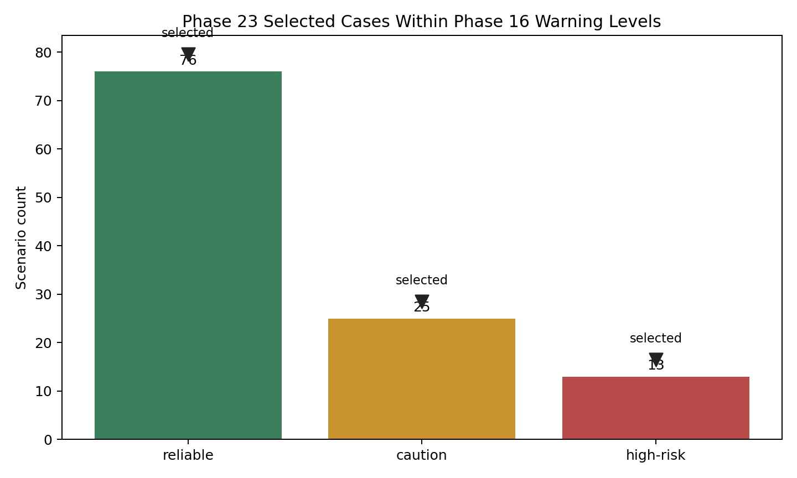

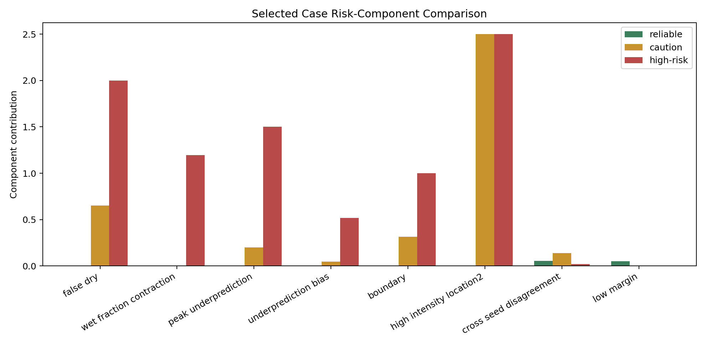

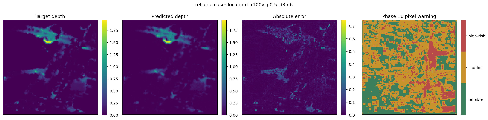

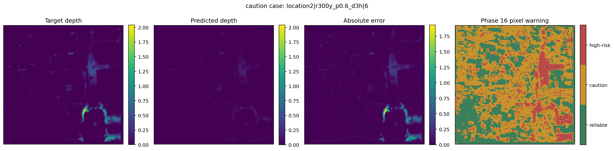

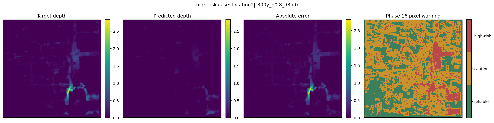

Phase 24 deepens the reliability-aware warning framework by diagnosing whether the existing Phase 10 recommended surrogate outputs are physically consistent in volume response, wet-area contraction, peak-depth preservation, wet-area connectivity, temporal behavior, and linkage with Phase 15/16 warning-risk labels. It is a diagnostic phase only: no retraining, architecture modification, Phase 10 loss modification, boundary-parameter tuning, new sweep, metric chasing, traffic-impact modeling, or new prediction generation was performed. See `docs/phase24_physical_consistency_deepening_findings.md`.

The main Phase 24 finding is that high-risk cases are not only statistically worse; they are physically less consistent. Relative to reliable cases, high-risk cases show stronger false-dry behavior, wet-area contraction, peak-depth underprediction, connectivity loss, and volume under-response. Correlations with `risk_score` are 0.913 for `false_dry_rate`, 0.862 for `wet_area_contraction`, 0.856 for `peak_depth_underprediction`, and 0.539 for `connectivity_loss_indicator`.

Phase 25 converts the Phase 24 physical-consistency diagnosis into a targeted model refinement: **Physics-Consistency Guided Surrogate Refinement: Target-Wet Recall Consistency**. The fixed Phase 10 boundary-band settings remain `boundary_band_pixels = 1` and `boundary_weight = 2.0`; Phase 25 adds a config-gated `target_wet_recall_consistency` loss with `weight = 0.02`, `threshold = 0.05`, `temperature = 0.02`, and `eps = 1e-6`. See `docs/phase25_three_seed_target_wet_recall_synthesis_findings.md`.

The main Phase 25 finding is that target-wet recall consistency is a strong three-seed positive candidate and a credible targeted refinement over the Phase 10 baseline. Across `seed123`, `seed42`, and `seed202`, it improved standard test metrics and reduced the intended aligned physical failure modes. Mean standard test deltas versus Phase 10 were `RMSE = -0.007057`, `MAE = -0.001519`, `wet/dry IoU = +0.076670`, `rollout stability = +0.001035`, and `step RMSE std = -0.001071`. Mean aligned physical deltas were `false_dry_rate = -0.111321`, `wet_area_contraction = -0.079104`, `relative_volume_bias = +0.105093`, `peak_depth_underprediction = -0.014962`, `RMSE = -0.007244`, and `MAE = -0.001885`.

Phase 25 is a diagnosis-driven, depth-field-compatible physical-consistency refinement. It improves target-wet recall and wet-region preservation while maintaining or improving standard prediction metrics. Remaining limitations include slight false-wet increase and non-uniform connectivity behavior; Phase 25 is not a complete hydrodynamic consistency solution and does not implement a full SWE/PINN residual.

Phase 26 performs **Strong Physics Constraint Feasibility Audit and Conservation-Proxy Diagnostics**. It is diagnostic only: no retraining, architecture modification, Phase 10 loss modification, boundary-parameter tuning, Phase 25 weight sweep, new prediction generation, or full SWE/PINN implementation was performed. See `docs/phase26_strong_physics_constraint_feasibility_findings.md` and `analysis/phase26_strong_physics_constraint_feasibility/conservation_residual_summary.md`.

The Phase 26 input audit found that repository-local `.npy` files were not found in the scanned directories; `evaluation_test` `forecast_maps.npz` artifacts under `runs/` are available; the representative flood spatial shape is `[128, 128]`; the Phase 10 recommended baseline is `boundary_weight = 2.0 / w20`; `w15` / `boundary_weight = 1.5` is rollback or non-default; Phase 25 `target_wet_recall` runs are available for `seed123`, `seed42`, and `seed202`; Level 4 conservation-oriented diagnostics are partially supported; Level 4 conservation-aware loss design remains unclear; and Level 5 full SWE/PINN residual constraints are not supported because velocity/flux fields, boundary inflow/outflow, pump/gate operations, `dx/dy`, and shape-compatible DEM/static elevation are missing or unclear.

The conservation-proxy diagnostics processed 114 map files and 2,736 step records. The main Phase 26 conclusion is that Phase 25 is directionally stronger than the Phase 10 recommended baseline on the main conservation-proxy diagnostics, especially aggregate water-volume response, false-dry volume loss, wet-area contraction, peak-depth preservation, RMSE, and MAE.

Key Phase 26 deltas show aggregate volume-response improvement and reduced under-response:

- Aggregate absolute relative volume bias improves across all three seeds: `seed123 = -0.064695`, `seed42 = -0.114739`, and `seed202 = -0.0405758`.
- False-dry volume loss decreases across all three seeds: `seed123 = -26.4163`, `seed42 = -32.2189`, and `seed202 = -13.3703`.
- Wet-area contraction decreases across all three seeds: `seed123 = -0.0848763`, `seed42 = -0.104508`, and `seed202 = -0.0519941`.

The boundary is important: Phase 25 improves aggregate water-volume response and reduces under-response, but it is not a strict timestep-wise conservation solution. Timestep-wise absolute relative volume bias is mixed: `seed42` improves, while `seed123` and `seed202` show very small increases. False-wet rate and false-wet volume excess increase slightly and should be treated as trade-offs.

Representative Phase 24 figures:

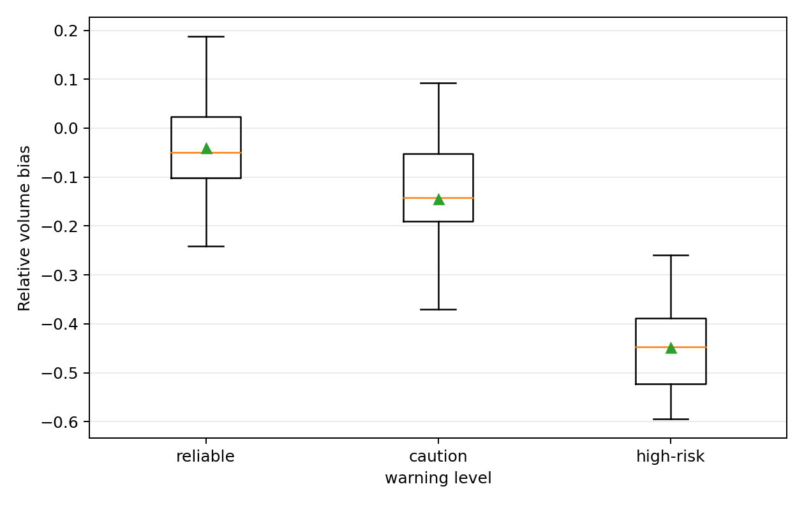

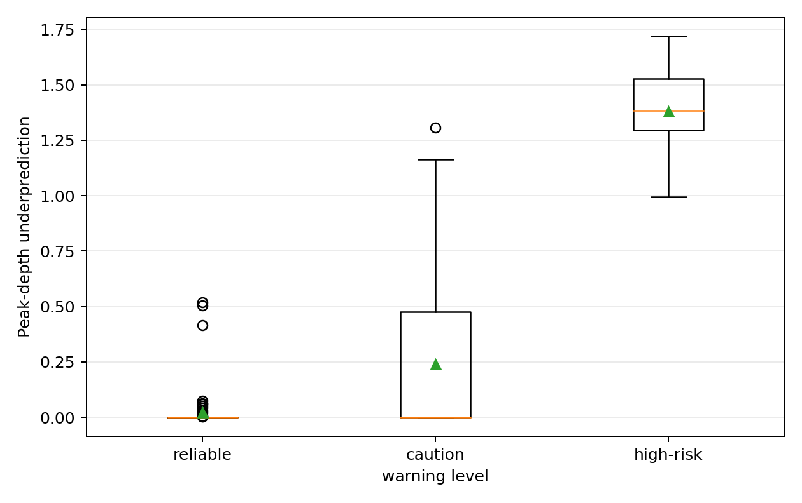

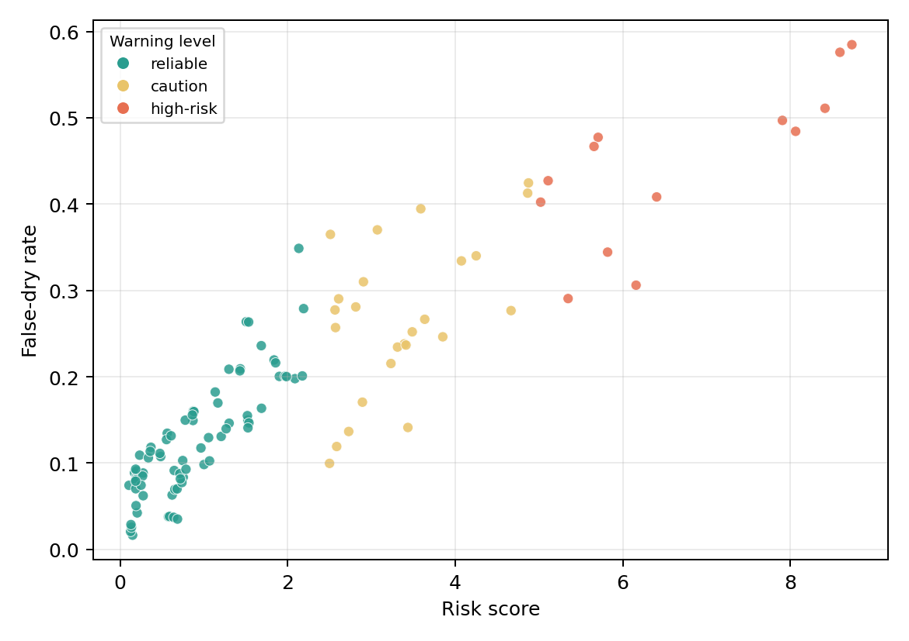

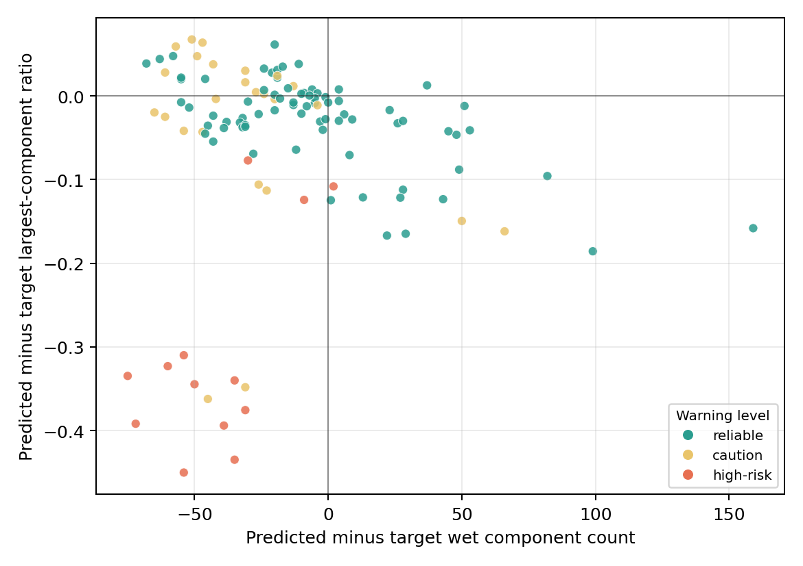

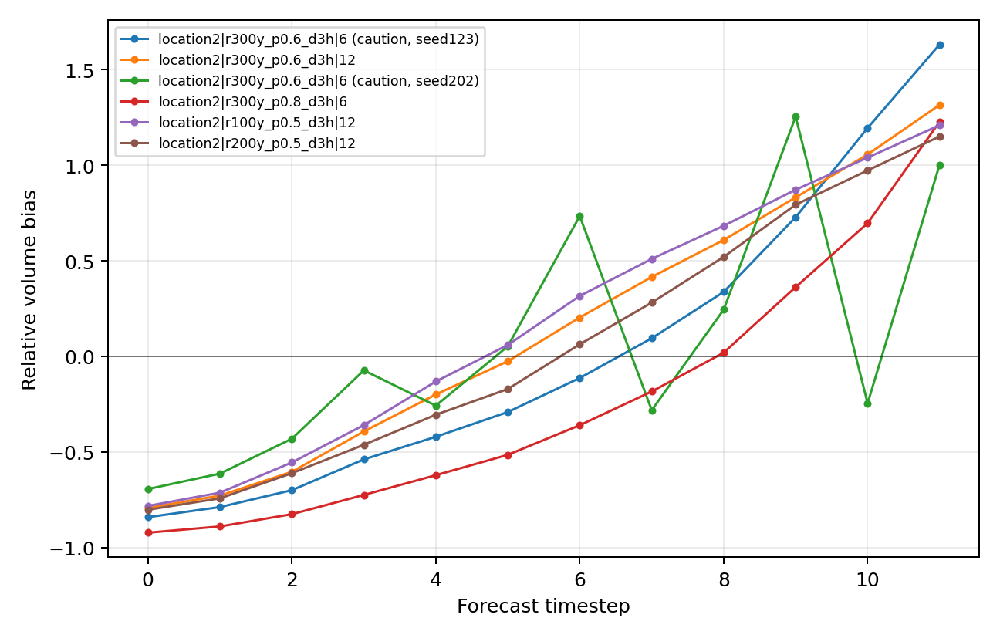

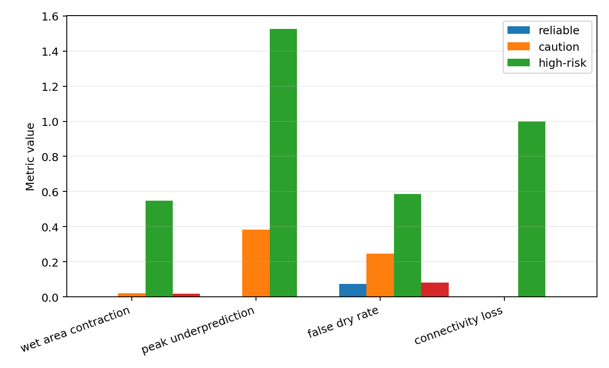


## Phase 12 Reliability Diagnostics

The first-pass Phase 12 reliability/applicability diagnosis evaluates where the Phase 10 recommended model is reliable and where caution is needed. The diagnosis uses saved test-facing forecast maps and does not involve retraining, architecture changes, Phase 10 loss changes, or a new boundary-weight sweep.

The main finding is that the model is useful for rapid spatiotemporal flood-process approximation, but reliability is not uniform. Exact wet/dry boundary cells remain the main bottleneck, moderate-to-deep target depths show stronger underprediction, and high-intensity `location2` cases dominate the highest-ranked failures.

### Boundary-distance reliability


### Depth-bin reliability


<details>
<summary>Expand additional Phase 12 diagnostic figures</summary>

### Timestep error trend


### Top failure cases


</details>


## Phase 13 Failure-Case Visual Summary

Phase 13 converts the highest-ranked Phase 12 failure cases into representative worst-timestep visual summaries. The top failures are not random scattered cases. They collapse into two high-intensity `location2` target scenarios repeated across seeds:

- `location2 / r300y_p0.6_d3h / start_idx = 0`, worst step 1
- `location2 / r300y_p0.8_d3h / start_idx = 0`, worst step 4

The visual summaries show systematic underprediction, reduced predicted wet fraction, local peak-depth underprediction, and false-dry dominated wet/dry mismatch.

### Representative failure-case visual summary


<details>
<summary>Expand additional Phase 13 failure-case figures</summary>

### Repeated `r300y_p0.8_d3h` failure case


### Cross-seed `r300y_p0.6_d3h` failure case


</details>


## Phase 14 Confidence Proxy Diagnostics

Phase 14 diagnoses whether output-space proxy signals can help identify when the current Phase 10 recommended model may be less reliable. It does not retrain the model, modify the architecture, tune Phase 10 parameters, or claim calibrated probabilistic uncertainty.

The main finding is that confidence margin is useful for wet/dry classification risk: low-margin bins show much higher wet/dry class error and false-dry rate. Cross-seed disagreement is weaker as a global scenario-error predictor and should be treated as an auxiliary disagreement proxy.

### Confidence margin versus wet/dry error


<details>
<summary>Expand additional Phase 14 diagnostic figure</summary>

### Seed disagreement versus scenario error


</details>

## Phase 15 Reliability Screening and Risk Mapping

Phase 15 provides the first implementation of reliability screening and risk mapping for the current Phase 10 recommended model. It combines rapid flood prediction with deterministic reliability screening and spatial risk mapping, turning the Phase 12 reliability boundaries, Phase 13 repeated failure cases, and Phase 14 confidence proxies into operational screening outputs.

The Phase 15 run loaded 57 Phase 10 map files, generated 114 scenario-level risk records, and generated 16,384 pixel-level risk records. Scenario screening assigned 76 records to `reliable`, 25 to `caution`, and 13 to `high-risk`. As a validation check, all 24 known Phase 13-like `location2` + `r300y` cases were flagged as `caution` or `high-risk`.

The Phase 15 labels are deterministic screening labels. They should not be interpreted as calibrated probabilities, Bayesian uncertainty, or a replacement for formal uncertainty calibration.

### Scenario risk category counts

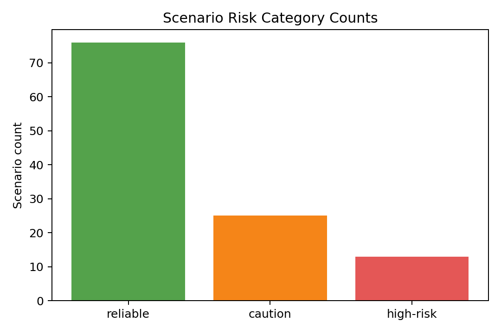

### Risk component heatmap

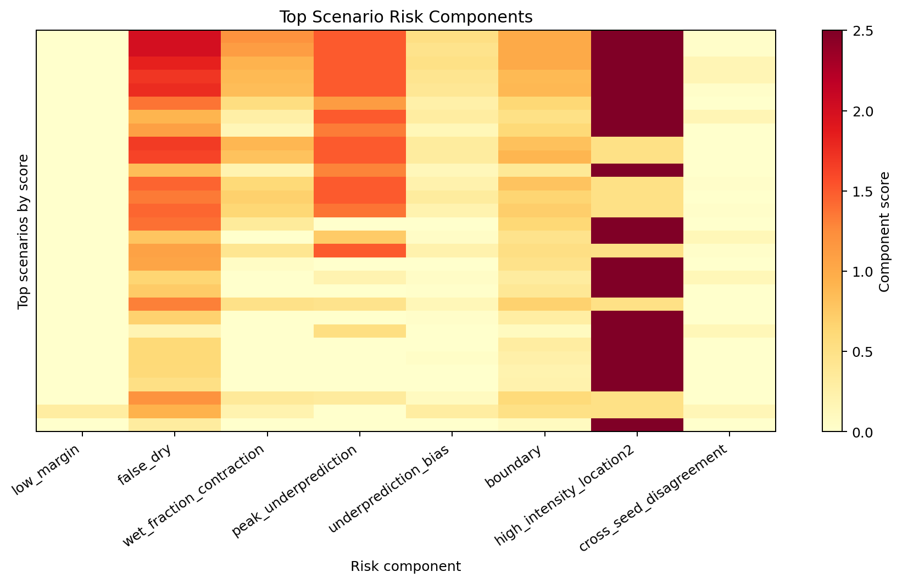

### Pixel risk map example

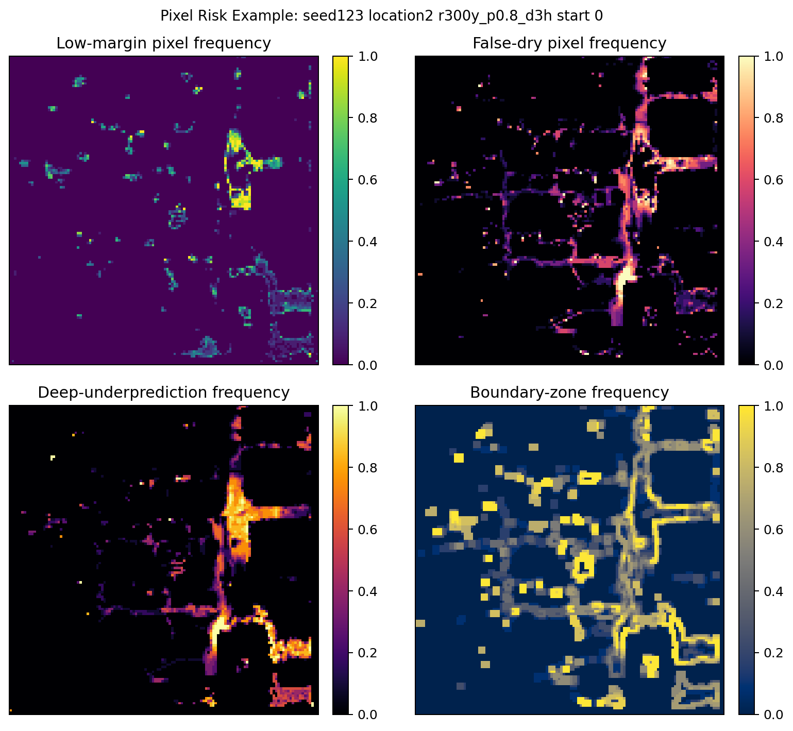

## Phase 16 Reliability-Aware Warning Rules and Applicability Boundary

Phase 16 provides the first implementation of reliability-aware warning rules and an applicability boundary for the current Phase 10 recommended model. It translates Phase 15 deterministic reliability-screening labels into application-oriented warning guidance without retraining, architecture changes, Phase 10 loss changes, `boundary_weight` tuning, `boundary_band_pixels` tuning, or a new sweep.

The Phase 16 scenario warning counts are 76 `reliable`, 25 `caution`, and 13 `high-risk`. The 13 high-risk warning cases match the Phase 15 high-risk cases. Pixel warning counts are 5,714 `reliable`, 8,805 `caution`, and 1,865 `high-risk`.

The warning labels are deterministic operational interpretation labels. They should not be read as calibrated probabilities, Bayesian uncertainty estimates, formal confidence intervals, or a substitute for a calibration design.

### Warning level counts

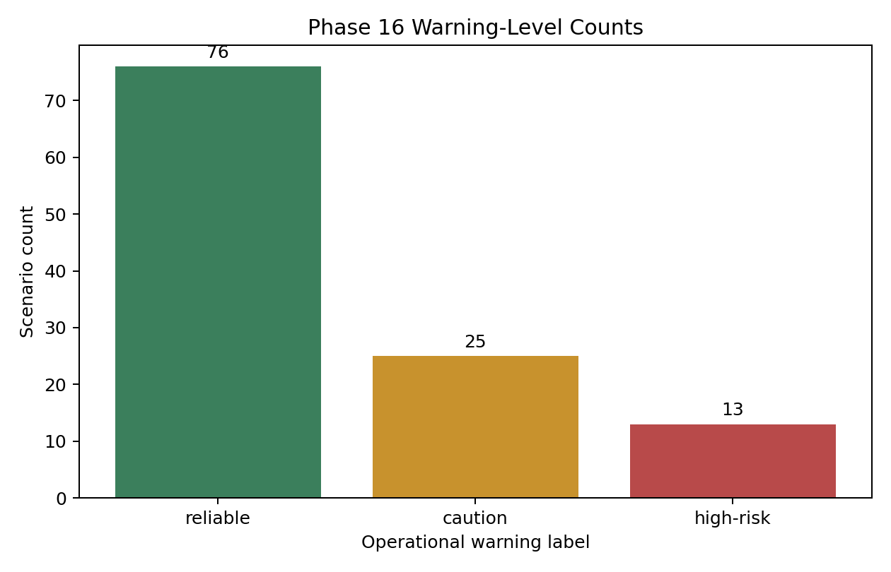

### Warning action matrix

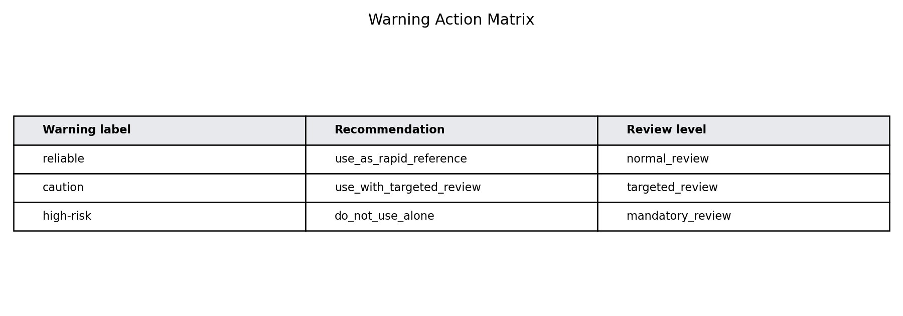

### Applicability boundary summary

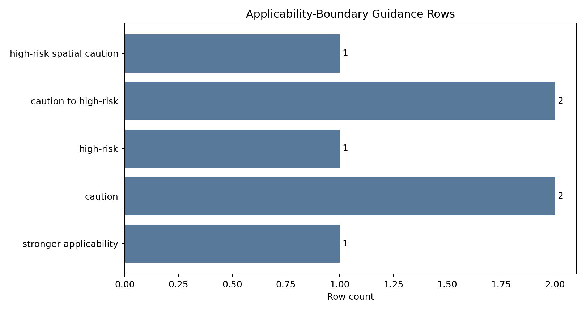

### Pixel warning map example

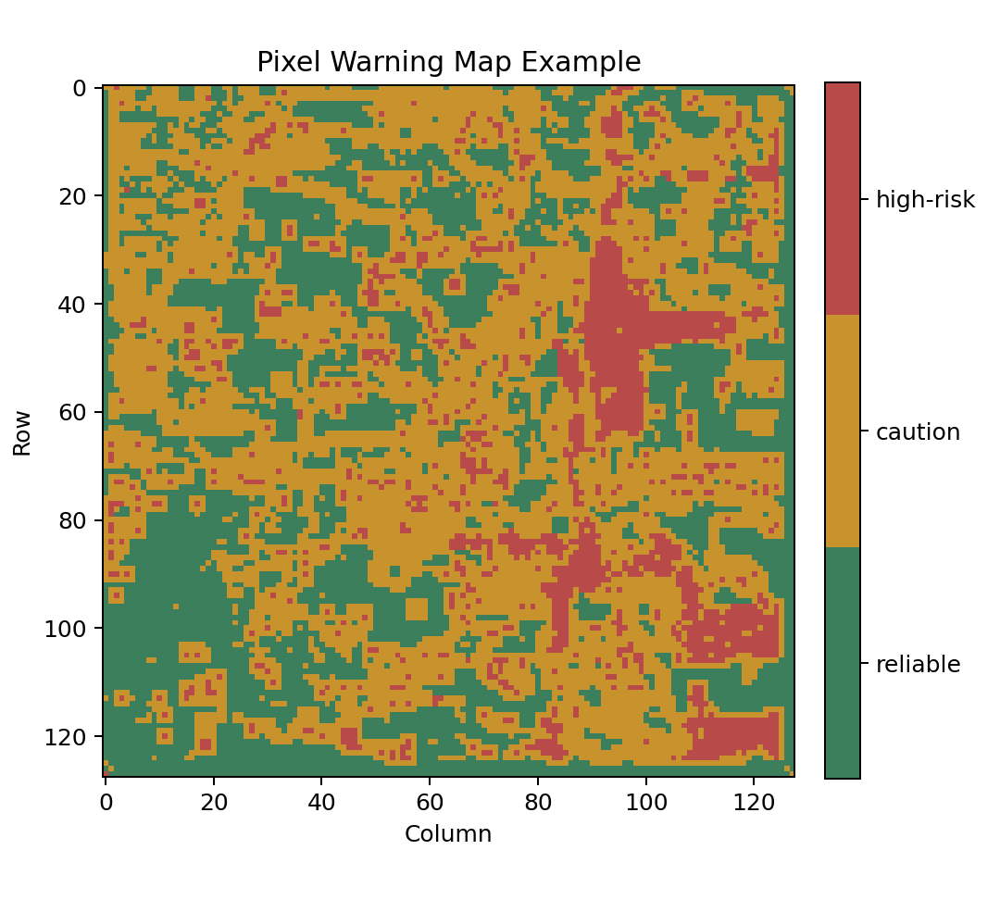

## Phase 17 Reliability-Aware Warning Framework Synthesis

Phase 17 is a synthesis/documentation phase, not a new experiment phase. It integrates the Phase 12 reliability and applicability diagnosis, Phase 13 representative failure-case visualization, Phase 14 confidence/disagreement proxy diagnostics, Phase 15 reliability screening and spatial risk mapping, and Phase 16 warning-rule and applicability-boundary guidance into one reliability-aware warning framework narrative.

The synthesis frames the project as rapid flood-depth prediction plus reliability diagnosis, failure-mode interpretation, confidence proxy diagnostics, spatial risk mapping, and warning-rule guidance. Phase 17 does not retrain models, modify architecture, modify the Phase 10 loss, tune `boundary_weight` or `boundary_band_pixels`, or open a new sweep. The recommended Phase 10 setting remains `boundary_band_pixels = 1` and `boundary_weight = 2.0`.

See `docs/phase17_reliability_warning_framework_synthesis.md` for the synthesis document.

## Phase 18 Manuscript-Oriented Reliability-Aware Warning Layer

Phase 18 is a manuscript-writing and synthesis phase, not a new experiment phase. It converts the completed Phase 12-17 reliability-aware warning framework into manuscript-ready material for "Reliability-Aware Warning Layer for Urban Flood Surrogate Prediction" without retraining, model changes, Phase 10 loss changes, boundary-parameter tuning, or new result generation. See `docs/manuscript_reliability_aware_warning_layer.md`.

## Phase 19 Manuscript Structure and Paper-Ready Consolidation

Phase 19 is a manuscript-structure and submission-consolidation phase, not a new experiment phase. It converts the completed Phase 12-18 reliability-aware warning framework and manuscript notes into a paper-ready outline and submission-oriented planning document covering positioning, candidate titles, abstract logic, section structure, figure/table inventory, contribution statements, limitations, submission positioning, and immediate writing tasks. See `docs/manuscript_structure_and_submission_consolidation.md`.

## Phase 20 Manuscript Draft Assembly

Phase 20 is a manuscript draft assembly phase, not a new experiment phase. It assembles the Phase 18 and Phase 19 manuscript-oriented materials into the first full draft skeleton for "Reliability-Aware Urban Flood Warning." See `docs/manuscript_draft_reliability_aware_urban_flood_warning.md`.

## Phase 21 Manuscript Evidence and Figure/Table Alignment

Phase 21 is an evidence-alignment phase, not a new experiment phase. It maps manuscript claims to existing evidence sources, figures, tables, JSON/CSV outputs, and findings documents before full manuscript expansion. See `docs/manuscript_evidence_figure_table_alignment.md`.

## Phase 22 Manuscript Full Draft Expansion

Phase 22 is a manuscript full-draft expansion phase, not a new experiment phase. It expands the Phase 20 manuscript skeleton into a fuller academic draft using the Phase 21 evidence-alignment document. See `docs/manuscript_full_draft_reliability_aware_urban_flood_warning.md`.

## Phase 23 Reliability-Aware Warning Case Study and Application Prototype

Phase 23 is an application-prototype phase, not a model-tuning phase. It converts the Phase 15 reliability screening, Phase 16 warning rules, and existing Phase 10 forecast map arrays into a representative warning-oriented case study covering one `reliable`, one `caution`, and one `high-risk` case.

Selected cases:

- `reliable`: `location1|r100y_p0.5_d3h|6`
- `caution`: `location2|r300y_p0.6_d3h|6`
- `high-risk`: `location2|r300y_p0.8_d3h|0`

The prototype demonstrates that the framework has moved beyond pure flood-depth prediction toward rapid prediction, reliability screening, scenario-level warning classification, pixel-level risk visualization, case-specific warning explanation, and applicability-boundary interpretation. See `docs/phase23_reliability_warning_case_study_findings.md`.

## Phase 24 Physical Consistency Deepening and Process Diagnostics

Phase 24 is a physical-consistency diagnostic phase for the existing Phase 10 recommended outputs. It links Phase 15/16 warning-risk labels with process-level behavior: false-dry rate, wet-area contraction, peak-depth underprediction, wet-connectivity loss, temporal volume response, and overall volume bias.

The diagnosis confirms that high-risk cases are physically less consistent than reliable cases. Warning-level means for `reliable` / `caution` / `high-risk` are 0.125 / 0.268 / 0.444 for `false_dry_rate`, 0.046 / 0.135 / 0.383 for `wet_area_contraction`, 0.024 m / 0.241 m / 1.381 m for `peak_depth_underprediction`, 0.197 / 0.240 / 1.000 for `connectivity_loss_indicator`, and -0.040 / -0.145 / -0.448 for `relative_volume_bias`. Topographic consistency was skipped because no shape-compatible DEM/static elevation layer was found.

The Phase 25 implication was a targeted model refinement around false-dry reduction and wet-area preservation while keeping the Phase 10 boundary-band settings fixed. A full SWE/PINN residual is not recommended unless compatible velocity, flux, boundary, DEM, and source-sink information become available.

## Phase 25 Physics-Consistency Guided Surrogate Refinement: Target-Wet Recall Consistency

Phase 25 adds a config-gated `target_wet_recall_consistency` loss to reduce false-dry behavior and wet-area contraction. It keeps the Phase 10 boundary-band settings fixed at `boundary_band_pixels = 1` and `boundary_weight = 2.0`.

The Phase 25 loss setting is:

- `target_wet_recall_consistency.weight = 0.02`
- `threshold = 0.05`
- `temperature = 0.02`
- `eps = 1e-6`

Across `seed123`, `seed42`, and `seed202`, Phase 25 consistently improved standard test metrics versus Phase 10. Mean deltas were `RMSE = -0.007057`, `MAE = -0.001519`, `wet/dry IoU = +0.076670`, `rollout stability = +0.001035`, and `step RMSE std = -0.001071`.

Aligned physical metrics also moved in the intended direction for the main diagnosed failure modes: mean deltas were `false_dry_rate = -0.111321`, `wet_area_contraction = -0.079104`, `relative_volume_bias = +0.105093`, `peak_depth_underprediction = -0.014962`, `RMSE = -0.007244`, and `MAE = -0.001885`. False-dry rate and wet-area contraction improved in all three seeds, with especially strong reductions in high-risk cases.

Phase 25 is a strong three-seed positive candidate and a credible targeted refinement over the Phase 10 baseline. It is not a complete physical-consistency solution: `false_wet_rate` increased slightly on average, `connectivity_loss_indicator` was not consistently improved, and the model still does not implement a full SWE/PINN residual.

Representative Phase 25 figures:

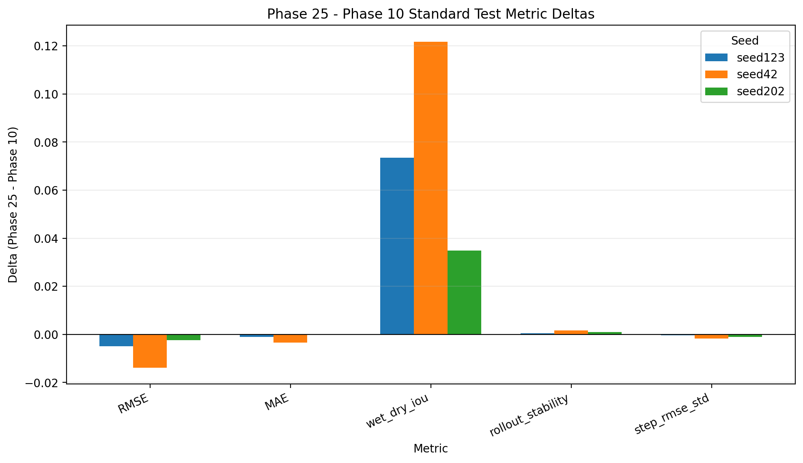

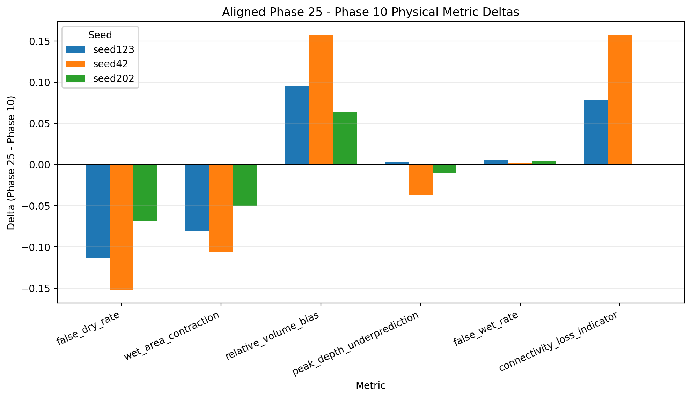

## Historical Qualitative Examples

The figures below are earlier-stage qualitative comparisons retained for visual reference. They are not the current primary evidence for the project state; the current project state is summarized above through Phase 26 strong-physics feasibility audit and conservation-proxy diagnostics.

<details>
<summary>Expand earlier-stage qualitative flood-map examples</summary>

### Baseline vs Phase 1

#### Spatial Inundation Comparison


#### Region-Averaged Process Comparison


### Phase 2A vs Phase 2B h16 on Difficult Case (`seed202`)

#### Spatial Inundation Comparison


#### Region-Averaged Process Comparison


### Phase 2A vs Phase 2B h16 on Favorable Case (`seed42`)

#### Spatial Inundation Comparison


#### Region-Averaged Process Comparison


</details>


## Research Roadmap

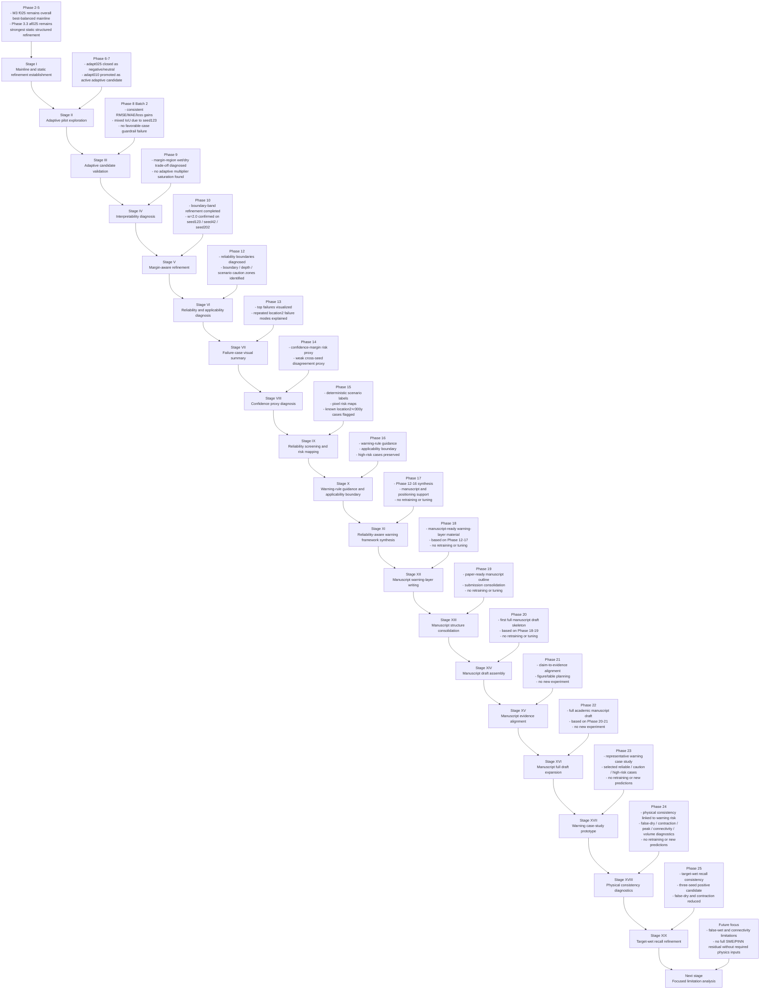
```mermaid
flowchart TD
    A[Stage I<br/>Mainline and static refinement establishment] --> B[Stage II<br/>Adaptive pilot exploration]
    B --> C[Stage III<br/>Adaptive candidate validation]
    C --> D[Stage IV<br/>Interpretability diagnosis]
    D --> E[Stage V<br/>Margin-aware refinement]
    E --> F[Stage VI<br/>Reliability and applicability diagnosis]
    F --> G[Stage VII<br/>Failure-case visual summary]
    G --> H[Stage VIII<br/>Confidence proxy diagnosis]
    H --> I[Stage IX<br/>Reliability screening and risk mapping]
    I --> J[Stage X<br/>Warning-rule guidance and applicability boundary]
    J --> K[Stage XI<br/>Reliability-aware warning framework synthesis]
    K --> L[Stage XII<br/>Manuscript warning-layer writing]
    L --> M[Stage XIII<br/>Manuscript structure consolidation]
    M --> N[Stage XIV<br/>Manuscript draft assembly]
    N --> O[Stage XV<br/>Manuscript evidence alignment]
    O --> P[Stage XVI<br/>Manuscript full draft expansion]
    P --> Q[Stage XVII<br/>Warning case-study prototype]
    Q --> R[Stage XVIII<br/>Physical consistency diagnostics]
    R --> S[Stage XIX<br/>Target-wet recall refinement]
    S --> T[Next stage<br/>Focused limitation analysis]

    A1[Phase 2-5<br/>- M3 f025 remains overall best-balanced mainline<br/>- Phase 3.3 af025 remains strongest static structured refinement] --> A
    B1[Phase 6-7<br/>- adapt025 closed as negative/neutral<br/>- adapt010 promoted as active adaptive candidate] --> B
    C1[Phase 8 Batch 2<br/>- consistent RMSE/MAE/loss gains<br/>- mixed IoU due to seed123<br/>- no favorable-case guardrail failure] --> C
    D1[Phase 9<br/>- margin-region wet/dry trade-off diagnosed<br/>- no adaptive multiplier saturation found] --> D
    E1[Phase 10<br/>- boundary-band refinement completed<br/>- w=2.0 confirmed on seed123 / seed42 / seed202] --> E
    F1[Phase 12<br/>- reliability boundaries diagnosed<br/>- boundary / depth / scenario caution zones identified] --> F
    G1[Phase 13<br/>- top failures visualized<br/>- repeated location2 failure modes explained] --> G
    H1[Phase 14<br/>- confidence-margin risk proxy<br/>- weak cross-seed disagreement proxy] --> H
    I1[Phase 15<br/>- deterministic scenario labels<br/>- pixel risk maps<br/>- known location2+r300y cases flagged] --> I
    J1[Phase 16<br/>- warning-rule guidance<br/>- applicability boundary<br/>- high-risk cases preserved] --> J
    K1[Phase 17<br/>- Phase 12-16 synthesis<br/>- manuscript and positioning support<br/>- no retraining or tuning] --> K
    L1[Phase 18<br/>- manuscript-ready warning-layer material<br/>- based on Phase 12-17<br/>- no retraining or tuning] --> L
    M1[Phase 19<br/>- paper-ready manuscript outline<br/>- submission consolidation<br/>- no retraining or tuning] --> M
    N1[Phase 20<br/>- first full manuscript draft skeleton<br/>- based on Phase 18-19<br/>- no retraining or tuning] --> N
    O1[Phase 21<br/>- claim-to-evidence alignment<br/>- figure/table planning<br/>- no new experiment] --> O
    P1[Phase 22<br/>- full academic manuscript draft<br/>- based on Phase 20-21<br/>- no new experiment] --> P
    Q1[Phase 23<br/>- representative warning case study<br/>- selected reliable / caution / high-risk cases<br/>- no retraining or new predictions] --> Q
    R1[Phase 24<br/>- physical consistency linked to warning risk<br/>- false-dry / contraction / peak / connectivity / volume diagnostics<br/>- no retraining or new predictions] --> R
    S1[Phase 25<br/>- target-wet recall consistency<br/>- three-seed positive candidate<br/>- false-dry and contraction reduced] --> S
    T1[Future focus<br/>- false-wet and connectivity limitations<br/>- no full SWE/PINN residual without required physics inputs] --> T
```


## Documentation

For the current staged experiment record, see:

- `docs/project_status.md`
- `docs/experiment_index.md`
- `docs/phase6_pilot_a_results.md`
- `docs/phase7_adapt010_results.md`
- `docs/phase8_batch1_results.md`
- `docs/phase8_tradeoff_positioning.md`
- `docs/phase9_interpretability_findings.md`
- `docs/phase10_margin_aware_findings.md`
- `docs/phase12_reliability_applicability_plan.md`
- `docs/phase12_reliability_applicability_findings.md`
- `docs/phase13_failure_case_visual_summary_plan.md`
- `docs/phase13_failure_case_visual_summary_findings.md`
- `docs/phase14_uncertainty_confidence_diagnostics_plan.md`
- `docs/phase14_uncertainty_confidence_diagnostics_findings.md`
- `docs/phase15_reliability_screening_risk_mapping_plan.md`
- `docs/phase15_reliability_screening_risk_mapping_findings.md`
- `docs/phase16_reliability_warning_applicability_plan.md`
- `docs/phase16_reliability_warning_applicability_findings.md`
- `docs/phase17_reliability_warning_framework_synthesis.md`
- `docs/manuscript_reliability_aware_warning_layer.md`
- `docs/manuscript_structure_and_submission_consolidation.md`
- `docs/manuscript_draft_reliability_aware_urban_flood_warning.md`
- `docs/manuscript_evidence_figure_table_alignment.md`
- `docs/manuscript_full_draft_reliability_aware_urban_flood_warning.md`
- `docs/phase23_reliability_warning_case_study_plan.md`
- `docs/phase23_reliability_warning_case_study_findings.md`
- `docs/phase24_physical_consistency_deepening_plan.md`
- `docs/phase24_physical_consistency_deepening_findings.md`
- `docs/phase25_physics_consistency_guided_refinement_plan.md`
- `docs/phase25_target_wet_recall_implementation_note.md`
- `docs/phase25_target_wet_recall_pilot_findings.md`
- `docs/phase25_seed42_guardrail_findings.md`
- `docs/phase25_three_seed_target_wet_recall_synthesis_findings.md`


## Dataset

This project uses the **UrbanFlood24 Lite** dataset.

Expected dataset directory:

```text
data/
  urbanflood24_lite/
    train/
    test/
```

The dataset includes:

- dynamic flood depth sequences: `flood.npy`
- rainfall forcing sequences: `rainfall.npy`
- static geospatial factors:
  - `absolute_DEM.npy`
  - `impervious.npy`
  - `manhole.npy`


## Task Definition

This project studies **multi-step flood process prediction**.

### Inputs

- past flood sequence
- past rainfall sequence
- future rainfall sequence
- static maps

### Output

- future flood depth sequence

In the current setup, the model uses:

- `input_steps = 12`
- `pred_steps = 12`


## Method

### Backbone

The forecasting backbone is based on a U-Net + TCN style spatiotemporal model.

### Physics-guided strategy

This repository currently has:

- a stable baseline built on U-Net + TCN
- stable physics guidance from non-negativity loss and wet/dry consistency loss
- optional architecture-level rainfall conditioning modules used for staged research experiments

### Stable baseline

The stable baseline path keeps the backbone unchanged and preserves the two stable physics-guided losses:

- non-negativity loss
- wet/dry consistency loss

### Optional rainfall conditioning

Architecture-level rainfall conditioning remains optional and config-driven. Existing training scripts and configs remain usable when the `rainfall_conditioning` block is omitted or disabled.

## Environment

Example setup:

```bash
conda create -n your_env_name python=3.8 -y
conda activate your_env_name
pip install -r requirements.txt
```

## Training

The current main training entry is:

```bash
python scripts/train_model.py --config <config_path>
```

### Example: stable loss-guided baseline (40 epochs, seed42)

```bash
python scripts/train_model.py --config configs/train_phase2_loss_only_40e_seed42.json
```

### Example: M3 mainline reference (40 epochs, seed42)

```bash
python scripts/train_model.py --config configs/train_phase2b_temporal_gate_h16_40e_seed42.json
```

### Example: Phase 3.3 protected response-split control (40 epochs, seed42)

```bash
python scripts/train_model.py --config configs/train_phase3_3_temporal_gate_residual_response_split_protected_h16_a010_f025_af025_40e_seed42.json
```

### Example: Phase 6 Pilot A adaptive scalar variant (5 epochs, seed42)

```bash
python scripts/train_model.py --config configs/train_phase6_pilot_a_temporal_gate_residual_response_split_protected_h16_a010_f025_af025_adapt025_5e_seed42.json
```

### Example: Phase 8 adaptive candidate validation (40 epochs, seed42)

```bash
python scripts/train_model.py --config configs/train_phase8_validation_temporal_gate_residual_response_split_protected_h16_a010_f025_af025_adapt010_40e_seed42.json
```

### Example: debug run

```bash
python scripts/train_model.py --config configs/train_phase2b_temporal_gate_debug.json
```

Additional experiment settings are provided under `configs/`.


## Evaluation and Visualization

Current evaluation combines staged validation metrics, paired qualitative checks, and Phase 12 reliability/applicability diagnostics.

The historical comparison scripts remain useful for inspecting representative cases and earlier visual outputs:

```bash
python compare_maps.py
python compare_timeseries.py
```

Phase 12 and later stages add reliability-focused diagnostic and screening scripts:

```bash
python scripts/analyze_phase12_reliability.py
python scripts/plot_phase12_reliability.py
python scripts/visualize_phase13_failure_cases.py
python scripts/analyze_phase14_confidence.py
python scripts/screen_phase15_reliability.py
python scripts/build_phase16_warning_rules.py
python scripts/build_phase23_warning_case_study.py
python scripts/analyze_phase24_physical_consistency.py
python scripts/compare_phase25_target_wet_recall_aligned.py
```

Generated figures and analysis outputs are organized under:

- `docs/figures/phase2_qualitative/` for earlier qualitative comparisons
- `analysis/phase12_reliability/figures/` for current reliability diagnostics
- `analysis/phase13_failure_cases/figures/` for representative failure-case visual summaries
- `analysis/phase14_confidence/figures/` for confidence proxy diagnostics
- `analysis/phase15_reliability_screening/figures/` for reliability-screening and risk-mapping outputs
- `analysis/phase16_warning_rules/figures/` for reliability-aware warning-rule and applicability-boundary outputs
- `analysis/phase23_warning_case_study/figures/` for representative warning case-study prototype outputs
- `analysis/phase24_physical_consistency/figures/` for physical-consistency and warning-risk linkage diagnostics
- `analysis/phase25_target_wet_recall_comparison/figures/` for Phase 25 versus Phase 10 summary comparison figures
- `analysis/phase26_strong_physics_constraint_feasibility/` for Phase 26 physics-input audit and conservation-proxy diagnostic outputs


## Current Project Status

The repository has completed the main Phase 2-3 architecture comparison cycle, closed the Phase 6 `adapt025` pilot as negative/neutral, established Phase 7/8 `adapt010` as the active adaptive candidate before margin-aware refinement, completed Phase 9 interpretability diagnosis, completed the Phase 10 margin-aware refinement intervention, completed the Phase 12-16 reliability-aware warning layer, completed the Phase 17-22 manuscript synthesis and drafting sequence, completed the Phase 23 reliability-aware warning case-study prototype, completed Phase 24 physical-consistency deepening diagnostics, completed Phase 25 target-wet recall consistency refinement through three-seed synthesis, and completed Phase 26 strong-physics feasibility audit and conservation-proxy diagnostics.

Current project-level conclusions:

- **M3 `f025` remains the overall best-balanced mainline reference**
- **Phase 3.3 `af025` remains the strongest static structured refinement**
- **Phase 6 Pilot A `adapt025` is closed as a negative/neutral result**
- **Phase 7/8 `adapt010` remains the active adaptive candidate before margin-aware refinement**
- **Phase 9 diagnosed the key wet/dry IoU issue as a mixed, margin-region, step-dependent trade-off**
- **Phase 10 boundary-band weighted wet/dry consistency refinement is the current recommended margin-aware setting**
- **Recommended Phase 10 setting: `boundary_band_pixels = 1`, `boundary_weight = 2.0`**
- **This setting passed test-facing confirmation on `seed123`, `seed42`, and `seed202`**
- **Phase 12 completed the first-pass reliability/applicability diagnosis of the Phase 10 recommended model**
- **Main Phase 12 caution zones: exact wet/dry boundary cells, shallow threshold-adjacent cells, moderate-to-deep depths, high-intensity `location2` cases, and local peak-depth extremes**
- **Phase 13 completed representative worst-timestep visual summaries for the highest-ranked failure cases**
- **Main Phase 13 finding: top failures collapse into two high-intensity `location2` target scenarios repeated across seeds, with systematic underprediction, reduced wet extent, local peak-depth underprediction, and false-dry dominated mismatch**
- **Phase 14 completed first-pass confidence proxy diagnostics**
- **Main Phase 14 finding: confidence margin is useful for wet/dry classification risk, while cross-seed disagreement is only an auxiliary proxy and not a strong standalone scenario-error predictor**
- **Phase 14 does not provide calibrated probabilistic uncertainty**
- **Phase 15 completed first-pass reliability screening and spatial risk mapping**
- **Phase 15 generated 114 scenario-level risk records and 16,384 pixel-level risk records from 57 Phase 10 map files**
- **Phase 15 scenario labels: 76 reliable, 25 caution, and 13 high-risk**
- **All 24 known Phase 13-like `location2` + `r300y` cases were flagged as `caution` or `high-risk`**
- **Phase 15 screening labels are deterministic labels, not calibrated probabilities or Bayesian uncertainty**
- **Phase 16 completed first-pass reliability-aware warning rules and applicability boundary guidance**
- **Phase 16 scenario warnings: 76 reliable, 25 caution, and 13 high-risk**
- **Phase 16 pixel warnings: 5,714 reliable, 8,805 caution, and 1,865 high-risk**
- **The 13 Phase 16 high-risk warning cases match the Phase 15 high-risk cases**
- **Phase 16 warning labels are deterministic operational interpretation labels, not calibrated probabilities, Bayesian uncertainty, or formal confidence intervals**
- **Phase 17 completed the synthesis of Phase 12-16 into a reliability-aware warning framework narrative for manuscript writing, README narrative, and project positioning**
- **Phase 17 is documentation synthesis only: no retraining, architecture change, Phase 10 loss change, boundary-parameter tuning, or new sweep**
- **Phase 18 has produced manuscript-ready reliability-aware warning layer material from the completed Phase 12-17 framework**
- **Phase 18 is writing/synthesis only: no retraining, architecture change, Phase 10 loss change, boundary-parameter tuning, new sweep, or new result generation**
- **Phase 19 has produced a paper-ready manuscript structure and submission-consolidation document from the completed Phase 12-18 materials**
- **Phase 19 is manuscript-structure consolidation only: no retraining, architecture change, Phase 10 loss change, boundary-parameter tuning, new sweep, or new result generation**
- **Phase 20 has produced the first full manuscript draft skeleton from the Phase 18-19 manuscript-oriented materials**
- **Phase 20 is manuscript draft assembly only: no retraining, architecture change, Phase 10 loss change, boundary-parameter tuning, new sweep, or new result generation**
- **Phase 21 has produced a claim-to-evidence and figure/table alignment document for the manuscript**
- **Phase 21 is evidence alignment only: no retraining, architecture change, Phase 10 loss change, boundary-parameter tuning, new sweep, new result generation, or new uncertainty claim**
- **Phase 22 has produced a fuller academic manuscript draft from the Phase 20 skeleton and Phase 21 evidence alignment**
- **Phase 22 is manuscript full-draft expansion only: no retraining, architecture change, Phase 10 loss change, boundary-parameter tuning, new sweep, new result generation, invented references, or unsupported claims**
- **Phase 23 has produced a representative reliability-aware warning case-study prototype**
- **Phase 23 selected one `reliable`, one `caution`, and one `high-risk` case for warning-oriented interpretation**
- **Phase 23 demonstrates rapid prediction, reliability screening, scenario-level warning classification, pixel-level risk visualization, case-specific warning explanation, and applicability-boundary interpretation**
- **Phase 23 is an application-prototype phase only: no retraining, architecture change, Phase 10 loss change, boundary-parameter tuning, new sweep, metric-chasing experiment, or new prediction generation**
- **Phase 24 has diagnosed physical consistency of the existing Phase 10 recommended outputs**
- **Main Phase 24 finding: high-risk cases are statistically worse and physically less consistent, with stronger false-dry behavior, wet-area contraction, peak-depth underprediction, connectivity loss, and volume under-response**
- **Phase 24 risk-score correlations: `false_dry_rate` = 0.913, `wet_area_contraction` = 0.862, `peak_depth_underprediction` = 0.856, and `connectivity_loss_indicator` = 0.539**
- **Phase 24 topographic consistency was skipped because no shape-compatible DEM/static elevation layer was found**
- **Phase 24 is diagnostic only: no retraining, architecture change, Phase 10 loss change, boundary-parameter tuning, new sweep, metric-chasing experiment, traffic-impact modeling, or new prediction generation**
- **Phase 25 completed Physics-Consistency Guided Surrogate Refinement: Target-Wet Recall Consistency**
- **Phase 25 keeps Phase 10 boundary-band settings fixed: `boundary_band_pixels = 1`, `boundary_weight = 2.0`**
- **Phase 25 adds config-gated `target_wet_recall_consistency` with `weight = 0.02`, `threshold = 0.05`, `temperature = 0.02`, and `eps = 1e-6`**
- **Mean Phase 25 standard test deltas versus Phase 10: `RMSE = -0.007057`, `MAE = -0.001519`, `wet/dry IoU = +0.076670`, `rollout stability = +0.001035`, and `step RMSE std = -0.001071`**
- **Mean aligned physical deltas versus Phase 10: `false_dry_rate = -0.111321`, `wet_area_contraction = -0.079104`, `relative_volume_bias = +0.105093`, `peak_depth_underprediction = -0.014962`, `RMSE = -0.007244`, and `MAE = -0.001885`**
- **Phase 25 is a strong three-seed positive candidate for reducing false-dry behavior and wet-area contraction, but not a complete physical-consistency solution**
- **Phase 26 completed Strong Physics Constraint Feasibility Audit and Conservation-Proxy Diagnostics**
- **Phase 26 found partial support for Level 4 conservation-proxy diagnostics, unclear support for Level 4 conservation-aware loss design, and no support for Level 5 full SWE/PINN residual constraints**
- **Phase 26 conservation-proxy diagnostics indicate aggregate volume-response improvement for Phase 25 versus Phase 10 w20, while preserving the guardrail that Phase 25 is not a strict timestep-wise conservation solution**

At this stage, the project has moved from broad model tuning to rapid flood prediction with reliability diagnosis, failure-mode interpretation, confidence proxy diagnostics, spatial risk mapping, warning-rule guidance, manuscript drafting, representative warning-oriented case-study prototyping, physical-consistency diagnostics, diagnosis-driven target-wet recall refinement, strong-physics feasibility audit, and conservation-proxy diagnostics. No broader Phase 10 boundary-weight sweep is justified.

## Representative Case Framing

Three representative cases continue to be useful for targeted comparison:

- `seed42`: favorable-case reference where stronger structured refinement must avoid unnecessary damage
- `seed202`: difficult-case reference where stronger structured refinement can show useful gains
- `seed123`: repeatability reference for checking whether candidate behavior generalizes beyond the two anchor cases

This framing motivated the Phase 6 Pilot A test, the Phase 7 conservative `adapt010` follow-up, the Phase 9 diagnosis, the Phase 10 margin-aware boundary-band refinement, the Phase 12 reliability/applicability diagnosis, the Phase 13 representative failure-case visual summary, the Phase 14 confidence proxy diagnosis, the Phase 15 reliability-screening layer, the Phase 16 warning-rule guidance layer, the Phase 17 reliability-aware framework synthesis, the Phase 19 manuscript-structure consolidation, the Phase 20 manuscript draft assembly, the Phase 21 manuscript evidence alignment, the Phase 22 manuscript full draft expansion, the Phase 23 warning case-study prototype, the Phase 24 physical-consistency diagnostics, the Phase 25 target-wet recall refinement, and the Phase 26 strong-physics feasibility audit.


## Adaptive Candidate and Margin-Aware Refinement

Phase 6 Pilot A kept the protected response-split path and added an optional bounded adaptive scalar. The earlier `adapt025` setting was technically stable, but it is now closed as a negative/neutral result:

```json
"rainfall_conditioning": {
  "enabled": true,
  "mode": "temporal_gate_residual_response_split_protected",
  "hidden_channels": 16,
  "residual_alpha": 0.10,
  "conditioned_fraction": 0.25,
  "active_fraction_within_response": 0.25,
  "adaptive_alpha_enabled": true,
  "adaptive_alpha_range": 0.25
}
```

The active adaptive candidate before margin-aware refinement is the more conservative Phase 7/Phase 8 `adapt010` setting:

```json
"rainfall_conditioning": {
  "enabled": true,
  "mode": "temporal_gate_residual_response_split_protected",
  "hidden_channels": 16,
  "residual_alpha": 0.10,
  "conditioned_fraction": 0.25,
  "active_fraction_within_response": 0.25,
  "adaptive_alpha_enabled": true,
  "adaptive_alpha_range": 0.10
}
```

When `adaptive_alpha_enabled` is omitted or set to `false`, the model falls back to the static protected response-split behavior. This keeps the adaptive addition optional and backward compatible with existing configs while preserving Phase 3.3 `af025` as the strongest static structured refinement.

Phase 10 keeps this adaptive structure and adds a margin-aware wet/dry consistency refinement. The recommended Phase 10 setting is:

```json
"wet_dry_consistency": {
  "enabled": true,
  "weight": 0.05,
  "threshold": 0.05,
  "temperature": 0.02,
  "boundary_band_pixels": 1,
  "boundary_weight": 2.0
}
```

This boundary-band setting has passed test-facing confirmation across `seed123`, `seed42`, and `seed202`. `boundary_weight = 1.5` is retained only as a conservative rollback setting.

Phase 25 keeps the Phase 10 boundary-band settings fixed and adds a targeted target-wet recall consistency term:

```json
"target_wet_recall_consistency": {
  "enabled": true,
  "weight": 0.02,
  "threshold": 0.05,
  "temperature": 0.02,
  "eps": 1e-6
}
```

## Future Work

The next justified follow-up is not another Phase 10 boundary-weight sweep. The current Phase 10 boundary-band setting remains `boundary_band_pixels = 1` and `boundary_weight = 2.0`, with Phase 25 target-wet recall consistency as a strong three-seed positive candidate and Phase 26 conservation-proxy diagnostics as the current strong-physics feasibility boundary.

Recommended next work:

- analyze the remaining Phase 25 limitations, especially slight false-wet increase and non-uniform connectivity behavior
- treat Phase 25 as a targeted target-wet recall and wet-region preservation refinement, not as a complete physical-consistency solution
- treat Phase 26 as conservation-proxy diagnostics and aggregate volume-response improvement evidence, not full conservation enforcement
- do not recommend a full SWE/PINN residual unless compatible velocity, flux, boundary, DEM, and source-sink information become available
- consider calibrated uncertainty only if calibration data and evaluation design are added
- keep `boundary_weight = 1.5` only as a conservative rollback setting
- avoid new boundary-weight sweeps unless a new diagnosis clearly justifies them
- keep using the Phase 12/13/14/15/16/17 reliability, failure-case, confidence-proxy, screening, warning-rule, and synthesis findings, plus the Phase 18-22 manuscript materials, the Phase 23 warning case-study prototype, the Phase 24 physical-consistency diagnostics, the Phase 25 three-seed target-wet recall synthesis, and the Phase 26 strong-physics feasibility audit, to define where the current model is reliable and where caution is required

## License

MIT License.
