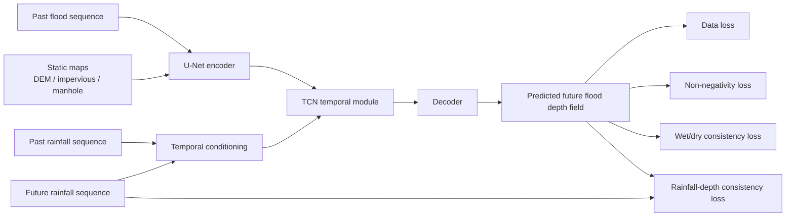
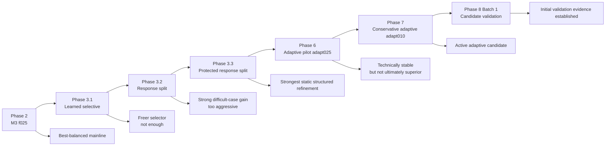
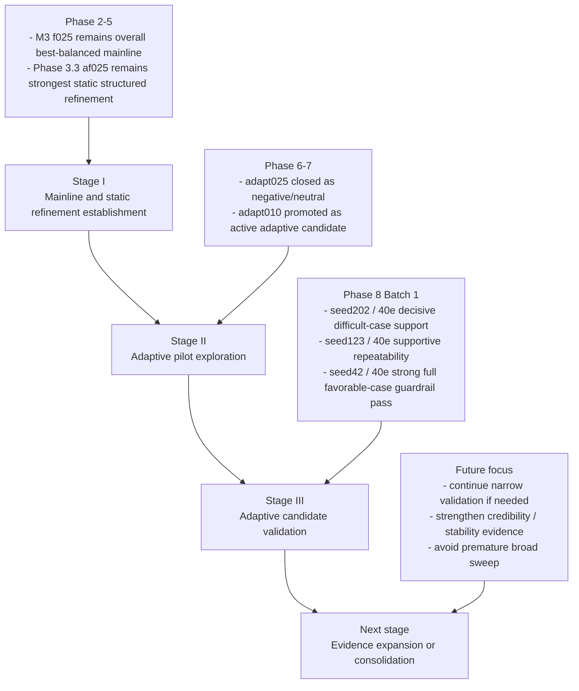

# Physics-Guided Urban Flood Process Prediction

A research prototype for physics-guided urban flood process prediction based on a U-Net + TCN framework.

## Method Diagram



## Stage Evolution




## Overview

This repository implements a spatiotemporal urban flood forecasting prototype using the UrbanFlood24 Lite dataset.  
The baseline model is built on a U-Net + TCN architecture for multi-step flood process prediction.

On top of the baseline, a Phase 1 physics-guided model is implemented by adding two output-space regularization terms:

- Non-negativity loss
- Wet/dry consistency loss

These physics-guided losses are imposed on the predicted future flood depth field at the output layer, while the backbone architecture remains unchanged.

## Current Mainline

The current overall best-balanced architecture is:

- `temporal_gate_residual_partial`
- `hidden_channels = 16`
- `residual_alpha = 0.10`
- `conditioned_fraction = 0.25`

This configuration is the current M3 `f025` mainline reference.

The strongest structured refinement discovered so far is:

- `temporal_gate_residual_response_split_protected`
- `hidden_channels = 16`
- `residual_alpha = 0.10`
- `conditioned_fraction = 0.25`
- `active_fraction_within_response = 0.25`

This configuration is the Phase 3.3 `af025` reference.

Phase 6 Pilot A added an optional bounded adaptive scalar on top of the protected response-split path. The mechanism was technically stable, but the `adapt025` setting did not beat the static Phase 3.3 `af025` control in final validation, so it is currently treated as a documented negative/neutral result rather than a new mainline.

Phase 7 tested a more conservative adaptive follow-up with `adaptive_alpha_range = 0.10`. This `adapt010` variant passed the decisive difficult-case `seed202 / 40e` check and also passed the favorable-case `seed42 / 5e` guardrail check, so it is now treated as the current adaptive candidate.

Phase 8 Batch 1 then provided the first narrow validation pass for that candidate:

- `seed202 / 40e` remains the decisive difficult-case support result
- `seed123 / 40e` provided supportive repeatability evidence with a mixed wet/dry IoU signal
- `seed42 / 40e` provided a strong full favorable-case guardrail pass

This means `adapt010` remains the active adaptive candidate and now has meaningful early validation evidence.


## Qualitative Examples

### Baseline vs Phase 1

#### Spatial Inundation Comparison


#### Region-Averaged Process Comparison


### Phase 2A vs Phase 2B h16 on Difficult Case (`seed202`)

#### Spatial Inundation Comparison


#### Region-Averaged Process Comparison


## More Qualitative Figures

<details>
<summary>Expand additional favorable-case comparisons</summary>

### Phase 2A vs Phase 2B h16 on Favorable Case (`seed42`)

#### Spatial Inundation Comparison


#### Region-Averaged Process Comparison


</details>


## Research Roadmap




## Documentation

For the current staged experiment record, see:

- `docs/project_status.md`
- `docs/experiment_index.md`
- `docs/phase3_summary.md`
- `docs/phase3_3_protected_response_split_notes.md`
- `docs/phase6_pilot_a_results.md`
- `docs/phase7_adapt010_results.md`
- `docs/phase8_batch1_results.md`


## Dataset

This project uses the **UrbanFlood24 Lite** dataset.

Expected dataset directory:

```text
data/
  urbanflood24_lite/
    train/
    test/
```

The dataset includes:

- dynamic flood depth sequences: `flood.npy`
- rainfall forcing sequences: `rainfall.npy`
- static geospatial factors:
  - `absolute_DEM.npy`
  - `impervious.npy`
  - `manhole.npy`


## Task Definition

This project studies **multi-step flood process prediction**.

### Inputs

- past flood sequence
- past rainfall sequence
- future rainfall sequence
- static maps

### Output

- future flood depth sequence

In the current setup, the model uses:

- `input_steps = 12`
- `pred_steps = 12`


## Method

### Backbone

The forecasting backbone is based on a U-Net + TCN style spatiotemporal model.

### Physics-guided strategy

This repository currently has:

- a stable baseline built on U-Net + TCN
- stable physics guidance from non-negativity loss and wet/dry consistency loss
- optional architecture-level rainfall conditioning modules used for staged research experiments

### Stable baseline

The stable baseline path keeps the backbone unchanged and preserves the two stable physics-guided losses:

- non-negativity loss
- wet/dry consistency loss

### Optional rainfall conditioning

Architecture-level rainfall conditioning remains optional and config-driven. Existing training scripts and configs remain usable when the `rainfall_conditioning` block is omitted or disabled.

## Environment

Example setup:

```bash
conda create -n your_env_name python=3.8 -y
conda activate your_env_name
pip install -r requirements.txt
```

## Training

The current main training entry is:

```bash
python scripts/train_model.py --config <config_path>
```

### Example: stable loss-guided baseline (40 epochs, seed42)

```bash
python scripts/train_model.py --config configs/train_phase2_loss_only_40e_seed42.json
```

### Example: M3 mainline reference (40 epochs, seed42)

```bash
python scripts/train_model.py --config configs/train_phase2b_temporal_gate_h16_40e_seed42.json
```

### Example: Phase 3.3 protected response-split control (40 epochs, seed42)

```bash
python scripts/train_model.py --config configs/train_phase3_3_temporal_gate_residual_response_split_protected_h16_a010_f025_af025_40e_seed42.json
```

### Example: Phase 6 Pilot A adaptive scalar variant (5 epochs, seed42)

```bash
python scripts/train_model.py --config configs/train_phase6_pilot_a_temporal_gate_residual_response_split_protected_h16_a010_f025_af025_adapt025_5e_seed42.json
```

### Example: debug run

```bash
python scripts/train_model.py --config configs/train_phase2b_temporal_gate_debug.json
```

Additional experiment settings are provided under `configs/`.


## Evaluation and Visualization

Current paired qualitative comparison scripts:

```bash
python compare_maps.py
python compare_timeseries.py
```

These scripts are currently used for paired qualitative comparison on representative cases such as `seed42` and `seed202`.

Generated figures are organized under:

- `docs/figures/phase2_qualitative/`


## Current Project Status

The repository has completed the main Phase 2 and Phase 3 architecture comparison cycle.

Current project-level conclusions:

- **M3 `f025` remains the overall best-balanced mainline**
- **Phase 3.3 `af025` remains the strongest structured refinement**
- **Phase 6 Pilot A `adapt025` is stable but not experimentally superior**
- **Phase 7 `adapt010` remains the current adaptive candidate, now supported by Phase 8 Batch 1 evidence**

At this stage, the project focus is targeted, hypothesis-driven refinement rather than broad exploratory tuning.

## Representative Case Framing

Two representative cases continue to be useful for targeted comparison:

- `seed42`: favorable-case reference where stronger structured refinement must avoid unnecessary damage
- `seed202`: difficult-case reference where stronger structured refinement can show useful gains

This framing motivated the Phase 6 Pilot A test and the Phase 7 conservative `adapt010` follow-up.


## Adaptive Pilot Switch

Phase 6 Pilot A keeps the protected response-split path and adds an optional bounded adaptive scalar:

```json
"rainfall_conditioning": {
  "enabled": true,
  "mode": "temporal_gate_residual_response_split_protected",
  "hidden_channels": 16,
  "residual_alpha": 0.10,
  "conditioned_fraction": 0.25,
  "active_fraction_within_response": 0.25,
  "adaptive_alpha_enabled": true,
  "adaptive_alpha_range": 0.25
}
```

When `adaptive_alpha_enabled` is omitted or set to `false`, the model falls back to the static protected response-split behavior. This keeps the Phase 6 addition optional and backward compatible with existing configs.

## Future Work

The next justified follow-up should start from the current `adapt010` candidate rather than returning to the broader `adapt025` setting:

- preserve the conservative adaptive-strength setting as the active direction
- keep further checks tightly scoped and hypothesis-driven
- avoid broad sweeps unless the next targeted comparison justifies expansion

## License

MIT License.


