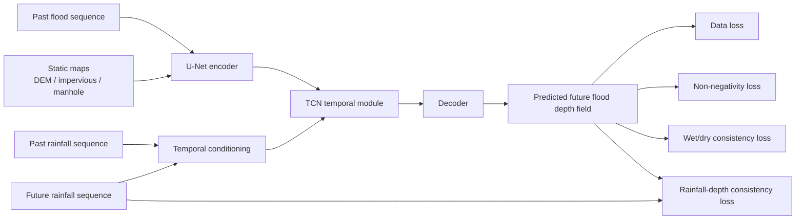

# Physics-Guided Urban Flood Process Prediction

A research prototype for physics-guided urban flood process prediction based on a U-Net + TCN framework.

## Method Diagram



## Overview

This repository implements a spatiotemporal urban flood forecasting prototype using the UrbanFlood24 Lite dataset.  
The baseline model is built on a U-Net + TCN architecture for multi-step flood process prediction.

On top of the baseline, a Phase 1 physics-guided model is implemented by adding two output-space regularization terms:

- Non-negativity loss
- Wet/dry consistency loss

These physics-guided losses are imposed on the predicted future flood depth field at the output layer, while the backbone architecture remains unchanged.

## Current Mainline

The current Phase 2 conclusion is:

- Primary candidate: Phase 2A (40 epochs)
- Strong alternative: Phase 2B h16 (40 epochs, rainfall-conditioned temporal gate)

This conclusion is based on completed 40-epoch multi-seed validation, test-set evaluation, and paired qualitative comparison.

## Phase 2 Documentation

For the latest Phase 2 experiment summaries, see:

- `docs/phase2_40e_multiseed_summary.md`
- `docs/phase2_40e_multiseed_test_summary.md`
- `docs/phase2_qualitative_comparison_notes.md`


## Dataset

This project uses the UrbanFlood24 Lite dataset.

Expected dataset directory:

```text
data/
└─ urbanflood24_lite/
   ├─ train/
   └─ test/
```

The dataset contains:

 Dynamic flood depth sequences (`flood.npy`)
 Rainfall forcing sequences (`rainfall.npy`)
 Static geospatial factors:

   `absolute_DEM.npy`
   `impervious.npy`
   `manhole.npy`

## Task Definition

The task is multi-step flood process prediction.

Inputs:

Past flood sequence
Past rainfall sequence
Future rainfall sequence
Static maps

Output:

Future flood depth sequence

In the current setup, the model uses:

 `input_steps = 12`
 `pred_steps = 12`

## Method

### Baseline

 Backbone: U-Net + TCN
 Pure data-driven flood process prediction

### Phase 1 Physics Guidance

The Phase 1 model keeps the same backbone as the baseline, but adds two physics-guided loss terms on the predicted future flood depth field:

`L_total = L_data + λ1  L_nonneg + λ2  L_wd`

where:

 `L_data` = data fidelity loss
 `L_nonneg` = non-negativity loss
 `L_wd` = wet/dry consistency loss

These constraints are applied at the output layer, rather than inside the encoder, decoder, or temporal module.

## Repository Structure

```text
configs/
datasets/
models/
scripts/
trainers/
utils/
compare_maps.py
compare_timeseries.py
README.md
```

## Environment

Example setup:

```bash
conda create -n your_env_name python=3.8 -y
conda activate your_env_name
pip install -r requirements.txt
```

## Training

Train the baseline model:

python scripts/train_model.py --config configs/train_baseline.json

Train the Phase 1 model:

python scripts/train_model.py --config configs/train_stage2b_phase1.json

Train the strict loss-only Phase 2 milestone:

python scripts/train_model.py --config configs/train_phase2_loss_only.json

Run the debug loss-only config:

python scripts/train_model.py --config configs/train_phase2_loss_only_debug.json

Rainfall-consistency weight sweep example:

python scripts/train_model.py --config configs/train_phase2_loss_only_w010.json

The new Phase 2 configs reuse `configs/urbanflood24_lite_adapter.json` for dataset location.
This milestone does not rewrite existing local dataset-path configs, so update that adapter config locally if your dataset lives somewhere else.

## Evaluation and Visualization

Current paired qualitative comparison scripts:

```bash
python compare_maps.py
python compare_timeseries.py
```
These scripts are currently used for Phase 2A vs Phase 2B h16 paired qualitative comparison on representative cases such as seed42 and seed202.

Generated figures are organized under:

`docs/figures/phase2_qualitative/`

## Current Project Status

The repository has now completed the formal Phase 2 comparison stage.

Completed items include:

- 40-epoch multi-seed validation
- 40-epoch multi-seed test-set evaluation
- paired qualitative comparison for representative cases

The current project conclusion is:

- **Primary candidate: Phase 2A (40 epochs)**
- **Strong alternative: Phase 2B h16 (40 epochs)**

At this stage, the project is no longer in unconstrained exploratory tuning. The current focus is on experiment organization, documentation cleanup, and next-stage method design.

## Representative Qualitative Findings

Two representative test cases are currently used for paired qualitative comparison:

- **seed42**: representative case favoring **Phase 2B h16**
- **seed202**: representative case favoring **Phase 2A**

Current qualitative observations are consistent with the broader experiment summary:

- **Phase 2B h16** shows genuinely stronger behavior on some cases
- **Phase 2A** remains the more stable overall choice across seeds
- spatial reconstruction tends to support the overall test conclusion more clearly than single-case process curves


### Region-Averaged Process Comparison


For the representative event, both models capture the overall recession trend of region-averaged water depth, while Phase 2A remains closer to the target during the middle-to-late forecast stages and yields a lower overall process error than the re-run Phase 1 reference.


## Future Work

Possible next directions include:

- further refinement of the Phase 2B temporal-gating design
- larger-scale validation across more seeds and settings
- stronger baselines
- more advanced hydrodynamic knowledge embedding
- cross-scenario generalization analysis

## Phase 2B Milestone 1

Phase 2B Milestone 1 keeps the Phase 2A loss system unchanged and adds one optional architecture-level module: a rainfall-conditioned temporal gate.

Enable it in the `model` section with:

```json
"rainfall_conditioning": {
  "enabled": true,
  "mode": "temporal_gate",
  "hidden_channels": 64
}
```

Use `configs/train_phase2b_temporal_gate.json` for the normal run and `configs/train_phase2b_temporal_gate_debug.json` for a quick debug run.

When this section is omitted or `enabled` is `false`, the model follows the existing baseline and Phase 2A path with no behavior change.

Minimal sanity check:

```bash
python scripts/sanity_check_phase2b_temporal_gate.py --base-config configs/train_phase2_loss_only_debug.json
```

## License

MIT License.


