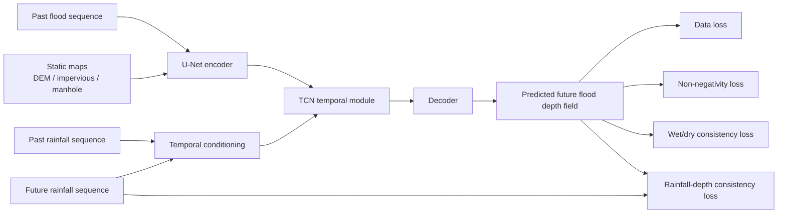
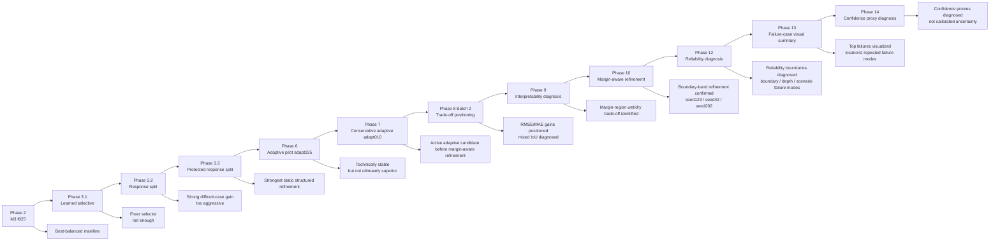
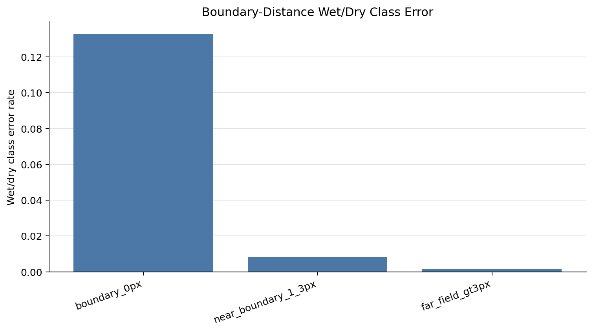
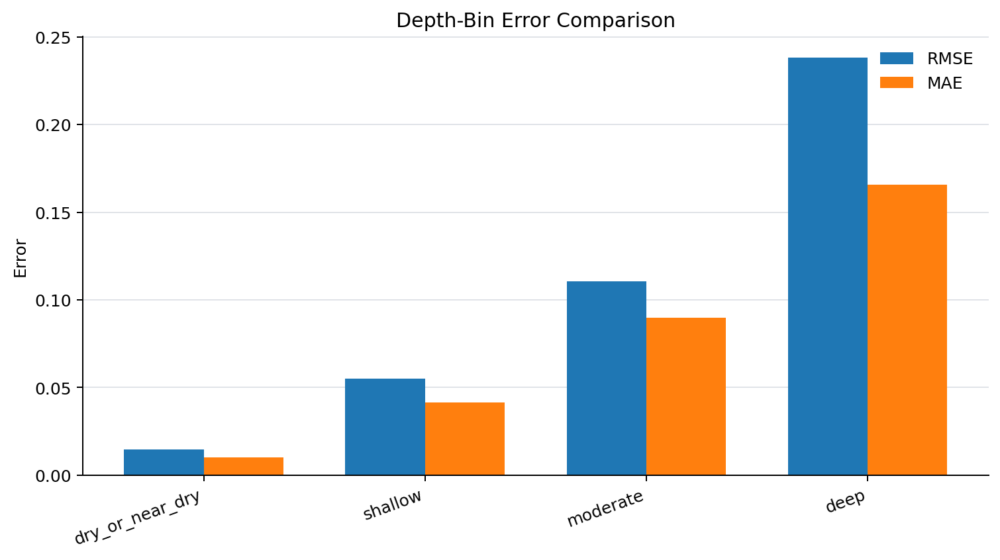
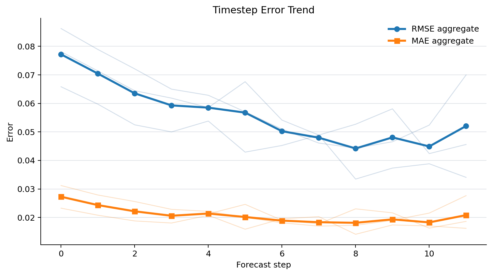
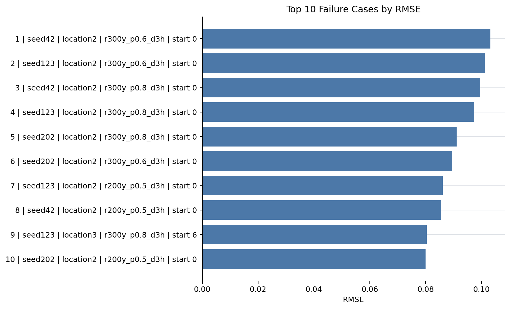
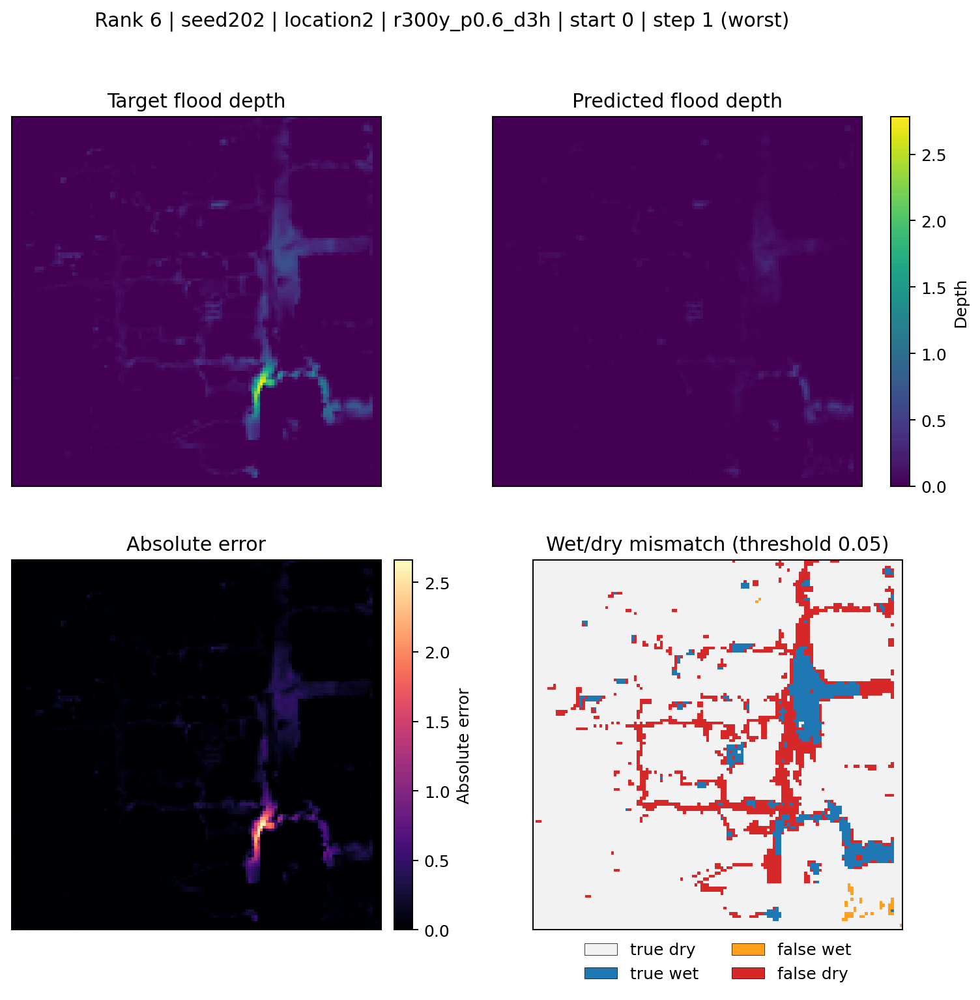
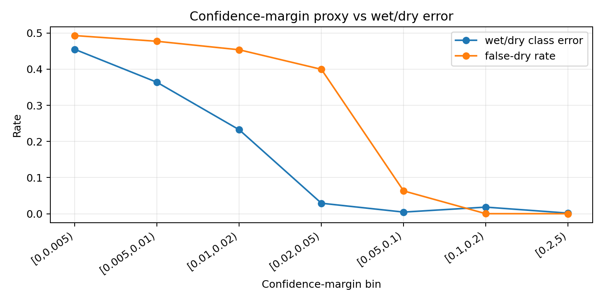
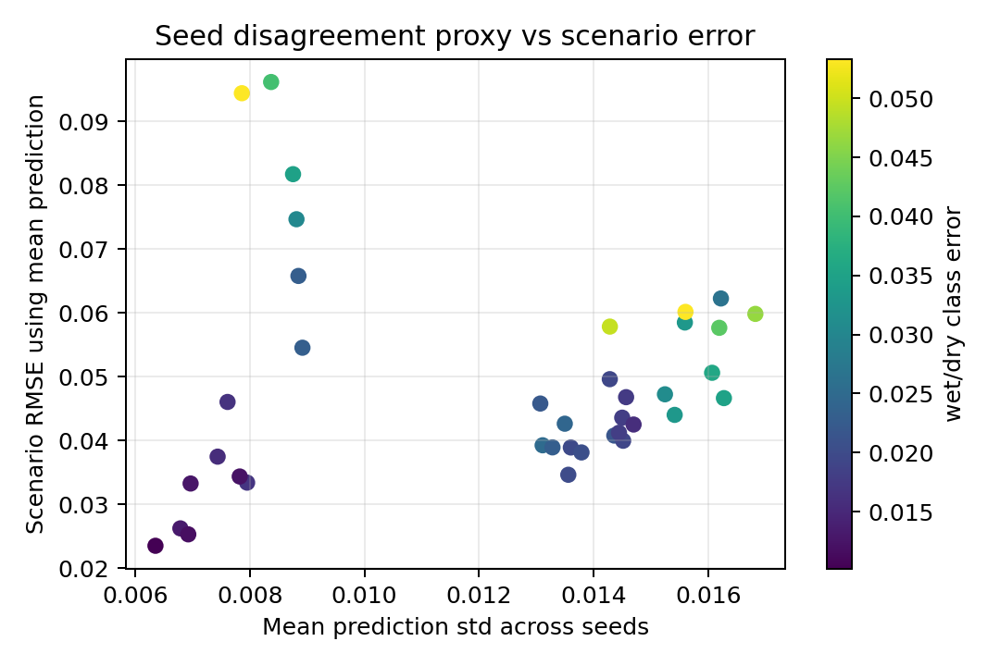
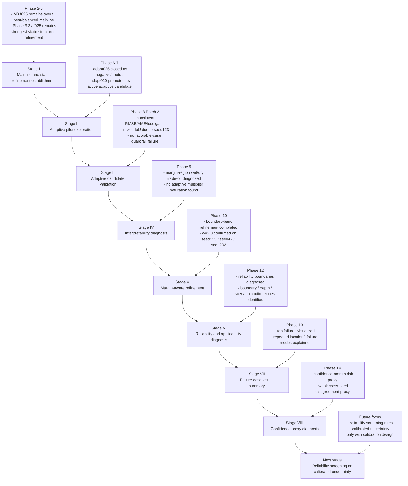

# Physics-Guided Urban Flood Process Prediction

A research prototype for physics-guided urban flood process prediction based on a U-Net + TCN framework.

## Method Diagram



## Stage Evolution




## Overview

This repository implements a spatiotemporal urban flood forecasting prototype using the UrbanFlood24 Lite dataset.  
The baseline model is built on a U-Net + TCN architecture for multi-step flood process prediction.

On top of the baseline, a Phase 1 physics-guided model is implemented by adding two output-space regularization terms:

- Non-negativity loss
- Wet/dry consistency loss

These physics-guided losses are imposed on the predicted future flood depth field at the output layer, while the backbone architecture remains unchanged.

## Current Mainline

The current overall best-balanced architecture reference is:

- `temporal_gate_residual_partial`
- `hidden_channels = 16`
- `residual_alpha = 0.10`
- `conditioned_fraction = 0.25`

This configuration remains the M3 `f025` mainline reference.

The strongest static structured refinement discovered so far is:

- `temporal_gate_residual_response_split_protected`
- `hidden_channels = 16`
- `residual_alpha = 0.10`
- `conditioned_fraction = 0.25`
- `active_fraction_within_response = 0.25`

This configuration remains the Phase 3.3 `af025` static reference.

Phase 6 Pilot A added an optional bounded adaptive scalar on top of the protected response-split path. The mechanism was technically stable, but the `adapt025` setting did not beat the static Phase 3.3 `af025` control in final validation, so it is treated as a documented negative/neutral adaptive result.

Phase 7 and Phase 8 established the more conservative `adapt010` setting as the active adaptive candidate before margin-aware refinement. It showed consistent RMSE, MAE, and loss gains across the required full `40e` comparisons, but Phase 8 also exposed a mixed wet/dry IoU trade-off, mainly through `seed123`.

Phase 9 diagnosed that trade-off as a mixed, margin-region, step-dependent wet/dry issue rather than adaptive multiplier saturation or seed-specific mechanism instability.

Phase 10 introduced a minimal diagnosis-driven intervention: boundary-band weighted wet/dry consistency refinement. The recommended Phase 10 setting is:

- `boundary_band_pixels = 1`
- `boundary_weight = 2.0`

This setting passed test-facing confirmation across the three key seeds:

- `seed123`: original mixed-IoU problem seed
- `seed42`: favorable-case guardrail seed
- `seed202`: difficult-case confirmation seed

`boundary_weight = 1.5` remains only a conservative rollback setting. No broader Phase 10 boundary-weight sweep is justified at this point.

Phase 12 then diagnosed the reliability and applicability boundaries of this recommended model using saved test-facing forecast maps. The first-pass diagnosis generated timestep-wise, depth-bin, boundary-distance, scenario-level, failure-case, and figure-based outputs under `analysis/phase12_reliability/`.

The main Phase 12 finding is that the model is useful for rapid spatiotemporal flood-process approximation, but reliability is not uniform. Exact wet/dry boundary cells remain the main bottleneck, moderate-to-deep target depths show stronger underprediction, and high-intensity `location2` cases dominate the highest-ranked failures.


## Phase 12 Reliability Diagnostics

The first-pass Phase 12 reliability/applicability diagnosis evaluates where the Phase 10 recommended model is reliable and where caution is needed. The diagnosis uses saved test-facing forecast maps and does not involve retraining, architecture changes, Phase 10 loss changes, or a new boundary-weight sweep.

The main finding is that the model is useful for rapid spatiotemporal flood-process approximation, but reliability is not uniform. Exact wet/dry boundary cells remain the main bottleneck, moderate-to-deep target depths show stronger underprediction, and high-intensity `location2` cases dominate the highest-ranked failures.

### Boundary-distance reliability



### Depth-bin reliability



<details>
<summary>Expand additional Phase 12 diagnostic figures</summary>

### Timestep error trend



### Top failure cases



</details>


## Phase 13 Failure-Case Visual Summary

Phase 13 converts the highest-ranked Phase 12 failure cases into representative worst-timestep visual summaries. The top failures are not random scattered cases. They collapse into two high-intensity `location2` target scenarios repeated across seeds:

- `location2 / r300y_p0.6_d3h / start_idx = 0`, worst step 1
- `location2 / r300y_p0.8_d3h / start_idx = 0`, worst step 4

The visual summaries show systematic underprediction, reduced predicted wet fraction, local peak-depth underprediction, and false-dry dominated wet/dry mismatch.

### Representative failure-case visual summary


<details>
<summary>Expand additional Phase 13 failure-case figures</summary>

### Repeated `r300y_p0.8_d3h` failure case


### Cross-seed `r300y_p0.6_d3h` failure case



</details>


## Phase 14 Confidence Proxy Diagnostics

Phase 14 diagnoses whether output-space proxy signals can help identify when the current Phase 10 recommended model may be less reliable. It does not retrain the model, modify the architecture, tune Phase 10 parameters, or claim calibrated probabilistic uncertainty.

The main finding is that confidence margin is useful for wet/dry classification risk: low-margin bins show much higher wet/dry class error and false-dry rate. Cross-seed disagreement is weaker as a global scenario-error predictor and should be treated as an auxiliary disagreement proxy.

### Confidence margin versus wet/dry error



<details>
<summary>Expand additional Phase 14 diagnostic figure</summary>

### Seed disagreement versus scenario error



</details>

## Historical Qualitative Examples

The figures below are earlier-stage qualitative comparisons retained for visual reference. They are not the current primary evidence for the project state; the current project state is summarized above through Phase 12 reliability/applicability diagnosis.

<details>
<summary>Expand earlier-stage qualitative flood-map examples</summary>

### Baseline vs Phase 1

#### Spatial Inundation Comparison


#### Region-Averaged Process Comparison


### Phase 2A vs Phase 2B h16 on Difficult Case (`seed202`)

#### Spatial Inundation Comparison


#### Region-Averaged Process Comparison


### Phase 2A vs Phase 2B h16 on Favorable Case (`seed42`)

#### Spatial Inundation Comparison


#### Region-Averaged Process Comparison


</details>


## Research Roadmap




## Documentation

For the current staged experiment record, see:

- `docs/project_status.md`
- `docs/experiment_index.md`
- `docs/phase6_pilot_a_results.md`
- `docs/phase7_adapt010_results.md`
- `docs/phase8_batch1_results.md`
- `docs/phase8_tradeoff_positioning.md`
- `docs/phase9_interpretability_findings.md`
- `docs/phase10_margin_aware_findings.md`
- `docs/phase12_reliability_applicability_plan.md`
- `docs/phase12_reliability_applicability_findings.md`
- `docs/phase13_failure_case_visual_summary_plan.md`
- `docs/phase13_failure_case_visual_summary_findings.md`
- `docs/phase14_uncertainty_confidence_diagnostics_plan.md`
- `docs/phase14_uncertainty_confidence_diagnostics_findings.md`


## Dataset

This project uses the **UrbanFlood24 Lite** dataset.

Expected dataset directory:

```text
data/
  urbanflood24_lite/
    train/
    test/
```

The dataset includes:

- dynamic flood depth sequences: `flood.npy`
- rainfall forcing sequences: `rainfall.npy`
- static geospatial factors:
  - `absolute_DEM.npy`
  - `impervious.npy`
  - `manhole.npy`


## Task Definition

This project studies **multi-step flood process prediction**.

### Inputs

- past flood sequence
- past rainfall sequence
- future rainfall sequence
- static maps

### Output

- future flood depth sequence

In the current setup, the model uses:

- `input_steps = 12`
- `pred_steps = 12`


## Method

### Backbone

The forecasting backbone is based on a U-Net + TCN style spatiotemporal model.

### Physics-guided strategy

This repository currently has:

- a stable baseline built on U-Net + TCN
- stable physics guidance from non-negativity loss and wet/dry consistency loss
- optional architecture-level rainfall conditioning modules used for staged research experiments

### Stable baseline

The stable baseline path keeps the backbone unchanged and preserves the two stable physics-guided losses:

- non-negativity loss
- wet/dry consistency loss

### Optional rainfall conditioning

Architecture-level rainfall conditioning remains optional and config-driven. Existing training scripts and configs remain usable when the `rainfall_conditioning` block is omitted or disabled.

## Environment

Example setup:

```bash
conda create -n your_env_name python=3.8 -y
conda activate your_env_name
pip install -r requirements.txt
```

## Training

The current main training entry is:

```bash
python scripts/train_model.py --config <config_path>
```

### Example: stable loss-guided baseline (40 epochs, seed42)

```bash
python scripts/train_model.py --config configs/train_phase2_loss_only_40e_seed42.json
```

### Example: M3 mainline reference (40 epochs, seed42)

```bash
python scripts/train_model.py --config configs/train_phase2b_temporal_gate_h16_40e_seed42.json
```

### Example: Phase 3.3 protected response-split control (40 epochs, seed42)

```bash
python scripts/train_model.py --config configs/train_phase3_3_temporal_gate_residual_response_split_protected_h16_a010_f025_af025_40e_seed42.json
```

### Example: Phase 6 Pilot A adaptive scalar variant (5 epochs, seed42)

```bash
python scripts/train_model.py --config configs/train_phase6_pilot_a_temporal_gate_residual_response_split_protected_h16_a010_f025_af025_adapt025_5e_seed42.json
```

### Example: Phase 8 adaptive candidate validation (40 epochs, seed42)

```bash
python scripts/train_model.py --config configs/train_phase8_validation_temporal_gate_residual_response_split_protected_h16_a010_f025_af025_adapt010_40e_seed42.json
```

### Example: debug run

```bash
python scripts/train_model.py --config configs/train_phase2b_temporal_gate_debug.json
```

Additional experiment settings are provided under `configs/`.


## Evaluation and Visualization

Current evaluation combines staged validation metrics, paired qualitative checks, and Phase 12 reliability/applicability diagnostics.

The historical comparison scripts remain useful for inspecting representative cases and earlier visual outputs:

```bash
python compare_maps.py
python compare_timeseries.py
```

Phase 12 adds reliability-focused diagnostic scripts:

```bash
python scripts/analyze_phase12_reliability.py
python scripts/plot_phase12_reliability.py
python scripts/visualize_phase13_failure_cases.py
python scripts/analyze_phase14_confidence.py
```

Generated figures are organized under:

- `docs/figures/phase2_qualitative/` for earlier qualitative comparisons
- `analysis/phase12_reliability/figures/` for current reliability diagnostics
- `analysis/phase13_failure_cases/figures/` for representative failure-case visual summaries
- `analysis/phase14_confidence/figures/` for confidence proxy diagnostics


## Current Project Status

The repository has completed the main Phase 2-3 architecture comparison cycle, closed the Phase 6 `adapt025` pilot as negative/neutral, established Phase 7/8 `adapt010` as the active adaptive candidate before margin-aware refinement, completed Phase 9 interpretability diagnosis, completed the Phase 10 margin-aware refinement intervention, completed the first-pass Phase 12 reliability/applicability diagnosis, completed the first-pass Phase 13 representative failure-case visual summary, and completed the first-pass Phase 14 proxy-based confidence diagnosis.

Current project-level conclusions:

- **M3 `f025` remains the overall best-balanced mainline reference**
- **Phase 3.3 `af025` remains the strongest static structured refinement**
- **Phase 6 Pilot A `adapt025` is closed as a negative/neutral result**
- **Phase 7/8 `adapt010` remains the active adaptive candidate before margin-aware refinement**
- **Phase 9 diagnosed the key wet/dry IoU issue as a mixed, margin-region, step-dependent trade-off**
- **Phase 10 boundary-band weighted wet/dry consistency refinement is the current recommended margin-aware setting**
- **Recommended Phase 10 setting: `boundary_band_pixels = 1`, `boundary_weight = 2.0`**
- **This setting passed test-facing confirmation on `seed123`, `seed42`, and `seed202`**
- **Phase 12 completed the first-pass reliability/applicability diagnosis of the Phase 10 recommended model**
- **Main Phase 12 caution zones: exact wet/dry boundary cells, shallow threshold-adjacent cells, moderate-to-deep depths, high-intensity `location2` cases, and local peak-depth extremes**
- **Phase 13 completed representative worst-timestep visual summaries for the highest-ranked failure cases**
- **Main Phase 13 finding: top failures collapse into two high-intensity `location2` target scenarios repeated across seeds, with systematic underprediction, reduced wet extent, local peak-depth underprediction, and false-dry dominated mismatch**
- **Phase 14 completed first-pass confidence proxy diagnostics**
- **Main Phase 14 finding: confidence margin is useful for wet/dry classification risk, while cross-seed disagreement is only an auxiliary proxy and not a strong standalone scenario-error predictor**
- **Phase 14 does not provide calibrated probabilistic uncertainty**

At this stage, the project focus should move from broad model tuning to reliability-boundary interpretation, representative failure-case explanation, confidence-proxy diagnosis, and possible reliability-screening rules. No broader Phase 10 boundary-weight sweep is justified.

## Representative Case Framing

Three representative cases continue to be useful for targeted comparison:

- `seed42`: favorable-case reference where stronger structured refinement must avoid unnecessary damage
- `seed202`: difficult-case reference where stronger structured refinement can show useful gains
- `seed123`: repeatability reference for checking whether candidate behavior generalizes beyond the two anchor cases

This framing motivated the Phase 6 Pilot A test, the Phase 7 conservative `adapt010` follow-up, the Phase 9 diagnosis, the Phase 10 margin-aware boundary-band refinement, the Phase 12 reliability/applicability diagnosis, the Phase 13 representative failure-case visual summary, and the Phase 14 confidence proxy diagnosis.


## Adaptive Candidate and Margin-Aware Refinement

Phase 6 Pilot A kept the protected response-split path and added an optional bounded adaptive scalar. The earlier `adapt025` setting was technically stable, but it is now closed as a negative/neutral result:

```json
"rainfall_conditioning": {
  "enabled": true,
  "mode": "temporal_gate_residual_response_split_protected",
  "hidden_channels": 16,
  "residual_alpha": 0.10,
  "conditioned_fraction": 0.25,
  "active_fraction_within_response": 0.25,
  "adaptive_alpha_enabled": true,
  "adaptive_alpha_range": 0.25
}
```

The active adaptive candidate before margin-aware refinement is the more conservative Phase 7/Phase 8 `adapt010` setting:

```json
"rainfall_conditioning": {
  "enabled": true,
  "mode": "temporal_gate_residual_response_split_protected",
  "hidden_channels": 16,
  "residual_alpha": 0.10,
  "conditioned_fraction": 0.25,
  "active_fraction_within_response": 0.25,
  "adaptive_alpha_enabled": true,
  "adaptive_alpha_range": 0.10
}
```

When `adaptive_alpha_enabled` is omitted or set to `false`, the model falls back to the static protected response-split behavior. This keeps the adaptive addition optional and backward compatible with existing configs while preserving Phase 3.3 `af025` as the strongest static structured refinement.

Phase 10 keeps this adaptive structure and adds a margin-aware wet/dry consistency refinement. The recommended Phase 10 setting is:

```json
"wet_dry_consistency": {
  "enabled": true,
  "weight": 0.05,
  "threshold": 0.05,
  "temperature": 0.02,
  "boundary_band_pixels": 1,
  "boundary_weight": 2.0
}
```

This boundary-band setting has passed test-facing confirmation across `seed123`, `seed42`, and `seed202`. `boundary_weight = 1.5` is retained only as a conservative rollback setting.

## Future Work

The next justified follow-up is not another Phase 10 boundary-weight sweep. The current recommended setting remains `boundary_band_pixels = 1` and `boundary_weight = 2.0`.

Recommended next work:

- consider confidence maps for Phase 13 failure cases
- consider scenario-level reliability screening rules based on Phase 12 to Phase 14 evidence
- consider calibrated uncertainty only if calibration data and evaluation design are added
- keep `boundary_weight = 1.5` only as a conservative rollback setting
- avoid new boundary-weight sweeps unless a new diagnosis clearly justifies them
- keep using the Phase 12/13/14 reliability, failure-case, and confidence-proxy findings to define where the current model is reliable and where caution is required

## License

MIT License.
