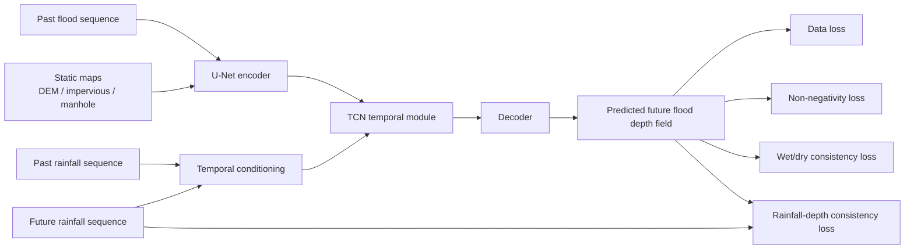
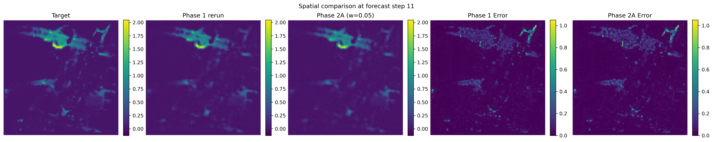
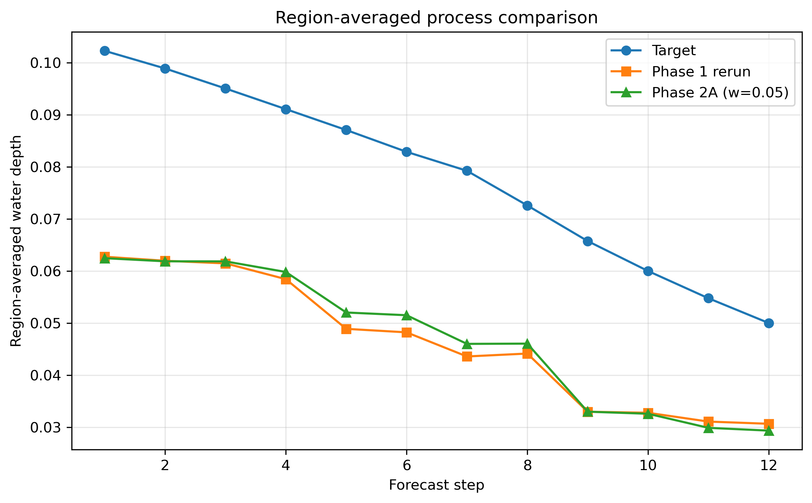

# Physics-Guided Urban Flood Process Prediction

A research prototype for physics-guided urban flood process prediction based on a U-Net + TCN framework.

## Method Diagram



## Overview

This repository implements a spatiotemporal urban flood forecasting prototype using the UrbanFlood24 Lite dataset.  
The baseline model is built on a U-Net + TCN architecture for multi-step flood process prediction.

On top of the baseline, a Phase 1 physics-guided model is implemented by adding two output-space regularization terms:

- Non-negativity loss
- Wet/dry consistency loss

These physics-guided losses are imposed on the predicted future flood depth field at the output layer, while the backbone architecture remains unchanged.

## Current Mainline

The current stable reference path is:

Phase 1 = Baseline + non-negativity loss + wet/dry consistency loss

Phase 1 remains the stable reference baseline for this repository.

In the current loss-only study, Phase 2A with refined `rainfall_depth_consistency` and `weight = 0.05` is the best validated candidate under the present three-seed check, while Phase 1 remains the stable reference baseline for comparison.


## Dataset

This project uses the UrbanFlood24 Lite dataset.

Expected dataset directory:

```text
data/
└─ urbanflood24_lite/
   ├─ train/
   └─ test/
```

The dataset contains:

 Dynamic flood depth sequences (`flood.npy`)
 Rainfall forcing sequences (`rainfall.npy`)
 Static geospatial factors:

   `absolute_DEM.npy`
   `impervious.npy`
   `manhole.npy`

## Task Definition

The task is multi-step flood process prediction.

Inputs:

Past flood sequence
Past rainfall sequence
Future rainfall sequence
Static maps

Output:

Future flood depth sequence

In the current setup, the model uses:

 `input_steps = 12`
 `pred_steps = 12`

## Method

### Baseline

 Backbone: U-Net + TCN
 Pure data-driven flood process prediction

### Phase 1 Physics Guidance

The Phase 1 model keeps the same backbone as the baseline, but adds two physics-guided loss terms on the predicted future flood depth field:

`L_total = L_data + λ1  L_nonneg + λ2  L_wd`

where:

 `L_data` = data fidelity loss
 `L_nonneg` = non-negativity loss
 `L_wd` = wet/dry consistency loss

These constraints are applied at the output layer, rather than inside the encoder, decoder, or temporal module.

## Repository Structure

```text
configs/
datasets/
models/
scripts/
trainers/
utils/
compare_maps.py
compare_timeseries.py
README.md
```

## Environment

Recommended environment:

```bash
conda create -n flood python=3.8 -y
conda activate flood
pip install -r requirements.txt
```

## Training

Train the baseline model:

python scripts/train_model.py --config configs/train_baseline.json

Train the Phase 1 model:

python scripts/train_model.py --config configs/train_stage2b_phase1.json

Train the strict loss-only Phase 2 milestone:

python scripts/train_model.py --config configs/train_phase2_loss_only.json

Run the debug loss-only config:

python scripts/train_model.py --config configs/train_phase2_loss_only_debug.json

Rainfall-consistency weight sweep example:

python scripts/train_model.py --config configs/train_phase2_loss_only_w010.json

The new Phase 2 configs reuse `configs/urbanflood24_lite_adapter.json` for dataset location.
This milestone does not rewrite existing local dataset-path configs, so update that adapter config locally if your dataset lives somewhere else.

## Evaluation and Visualization
Example scripts:

```bash
python compare_maps.py
python compare_timeseries.py
```

## Current Results

The table below reports the previously validated mainline results under the earlier repository reference setting.

The Phase 2A section later in this README reports the latest single-seed 20-epoch tuning comparison under the current loss-only code path.

| Model    | Val RMSE | Val MAE | Val wet/dry IoU | Val rollout stability |
| -------- | -------: | ------: | --------------: | --------------------: |
| Baseline |   0.0774 |  0.0236 |          0.4281 |                0.9919 |
| Phase 1  |   0.0541 |  0.0185 |          0.6167 |                0.9915 |

These results indicate that lightweight output-space physics guidance can improve both flood depth prediction accuracy and wet-region boundary recovery without degrading rollout stability.
## Qualitative Examples

### Spatial Comparison



A qualitative comparison at the selected forecast step shows that the Phase 2A model recovers the main inundation belt and local wet regions more completely than the re-run Phase 1 reference, while also reducing the spatial error extent in several flooded patches.

### Region-Averaged Process Comparison



For the representative event, both models capture the overall recession trend of region-averaged water depth, while Phase 2A remains closer to the target during the middle-to-late forecast stages and yields a lower overall process error than the re-run Phase 1 reference.

## Current Limitations

This repository is a research prototype, not a production-ready engineering system.

Current limitations include:

 Results are currently validated on UrbanFlood24 Lite
 Initial three-seed validation has been completed, but larger-scale statistical validation across more seeds and settings is still needed.
 More external baselines can be added
 More advanced physics terms have not yet shown stable gains

## Phase 2A Loss-Only Tuning Note

Phase 2A keeps the backbone unchanged (U-Net + TCN) and extends the Phase 1 loss design with a refined `rainfall_depth_consistency` term.

In the current single-seed 20-epoch tuning runs, the rainfall-consistency weight shows a clear sensitivity:

| Setting | Best epoch | Val RMSE | Val MAE | Val wet/dry IoU | Val rollout stability |
| -------- | ---------: | -------: | ------: | --------------: | --------------------: |
| Phase 1 rerun | 19 | 0.06155 | 0.02118 | 0.59050 | 0.99175 |
| Phase 2A, weight = 0.03 | 19 | 0.06822 | 0.02288 | 0.55547 | 0.99116 |
| Phase 2A, weight = 0.05 | 19 | 0.05928 | 0.02048 | 0.60766 | 0.99189 |
| Phase 2A, weight = 0.10 | 19 | 0.06526 | 0.02221 | 0.56406 | 0.99142 |
| Rainfall-only ablation | 19 | 0.06730 | 0.02217 | 0.45620 | 0.99149 |

These runs suggest that the refined rainfall-depth consistency term is useful, but not monotonic with respect to weight.
A small weight (0.03) is too weak, while a larger weight (0.10) degrades performance.
Under the current single-seed setup, `weight = 0.05` is the best tested setting and outperforms the re-run Phase 1 reference.

At this stage, the current recommended Phase 2A configuration is:

- `configs/train_phase2_loss_only.json` as the main Phase 2A config
- `configs/train_phase2_loss_only_debug.json` for quick debug and sanity checks
- `configs/train_phase2_loss_only_w010.json` as a higher-weight comparison config

## Preliminary Multi-Seed Check

To verify that the Phase 2A gain is not limited to a single random seed, we further compared the Phase 1 reference and the Phase 2A (`rainfall_depth_consistency`, `weight = 0.05`) configuration under three seeds.

| Seed | Model | Best epoch | Val RMSE | Val MAE | Val wet/dry IoU | Val rollout stability |
| ---- | ----- | ---------: | -------: | ------: | --------------: | --------------------: |
| 42   | Phase 1 | 19 | 0.06155 | 0.02118 | 0.59050 | 0.99175 |
| 42   | Phase 2A (w = 0.05) | 19 | 0.05928 | 0.02048 | 0.60766 | 0.99189 |
| 123  | Phase 1 | 19 | 0.05903 | 0.02380 | 0.68349 | 0.99375 |
| 123  | Phase 2A (w = 0.05) | 19 | 0.05761 | 0.02317 | 0.68787 | 0.99347 |
| 202  | Phase 1 | 20 | 0.05352 | 0.02163 | 0.66935 | 0.99267 |
| 202  | Phase 2A (w = 0.05) | 20 | 0.05198 | 0.02119 | 0.68314 | 0.99275 |

Across the three tested seeds, Phase 2A with `weight = 0.05` consistently improves validation RMSE, MAE, and wet/dry IoU over the corresponding Phase 1 reference. Rollout stability does not show a strong and fully consistent gain across all seeds, but it also does not degrade systematically. At the current stage, these results support Phase 2A (`weight = 0.05`) as a stronger accuracy-oriented loss-only candidate, while additional seeds are still desirable before making a stronger statistical claim.

### Three-Seed Statistical Summary

Using the best epoch from each run, we further summarize the three-seed results with mean ± sample standard deviation.

| Model | Val RMSE | Val MAE | Val wet/dry IoU | Val rollout stability |
| ---- | -------: | ------: | --------------: | --------------------: |
| Phase 1 (3 seeds) | 0.05803 ± 0.00411 | 0.02220 ± 0.00140 | 0.64778 ± 0.05011 | 0.99272 ± 0.00100 |
| Phase 2A (w = 0.05, 3 seeds) | 0.05629 ± 0.00383 | 0.02161 ± 0.00139 | 0.65956 ± 0.04501 | 0.99270 ± 0.00079 |

On average across the current three tested seeds, Phase 2A (`weight = 0.05`) improves validation RMSE, MAE, and wet/dry IoU relative to the corresponding Phase 1 reference. Rollout stability remains essentially unchanged at this stage. These results further support Phase 2A (`weight = 0.05`) as the current stronger loss-only candidate.

## Future Work

Planned extensions include:

 Test-set evaluation
 Larger-scale statistical validation across more seeds and settings
 Stronger baselines
 More advanced hydrodynamic knowledge embedding
 Cross-scenario generalization analysis

## Phase 2B Milestone 1

Phase 2B Milestone 1 keeps the Phase 2A loss system unchanged and adds one optional architecture-level module: a rainfall-conditioned temporal gate.

Enable it in the `model` section with:

```json
"rainfall_conditioning": {
  "enabled": true,
  "mode": "temporal_gate",
  "hidden_channels": 64
}
```

Use `configs/train_phase2b_temporal_gate.json` for the normal run and `configs/train_phase2b_temporal_gate_debug.json` for a quick debug run.

When this section is omitted or `enabled` is `false`, the model follows the existing baseline and Phase 2A path with no behavior change.

Minimal sanity check:

```bash
python scripts/sanity_check_phase2b_temporal_gate.py --base-config configs/train_phase2_loss_only_debug.json
```

## License

MIT License.


