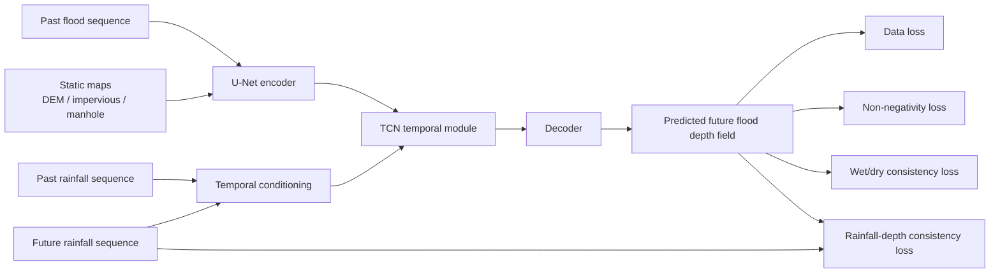

# Physics-Guided Urban Flood Process Prediction

A research prototype for physics-guided urban flood process prediction based on a U-Net + TCN framework.

## Method Diagram



## Overview

This repository implements a spatiotemporal urban flood forecasting prototype using the UrbanFlood24 Lite dataset.  
The baseline model is built on a U-Net + TCN architecture for multi-step flood process prediction.

On top of the baseline, a Phase 1 physics-guided model is implemented by adding two output-space regularization terms:

- Non-negativity loss
- Wet/dry consistency loss

These physics-guided losses are imposed on the predicted future flood depth field at the output layer, while the backbone architecture remains unchanged.

## Current Mainline

The current Phase 2 conclusion is:

- Primary candidate: Phase 2A (40 epochs)
- Strong alternative: Phase 2B h16 (40 epochs, rainfall-conditioned temporal gate)

This conclusion is based on completed 40-epoch multi-seed validation, test-set evaluation, and paired qualitative comparison.

## Phase 2 Documentation

For the latest Phase 2 experiment summaries, see:

- `docs/phase2_40e_multiseed_summary.md`
- `docs/phase2_40e_multiseed_test_summary.md`
- `docs/phase2_qualitative_comparison_notes.md`


## Dataset

This project uses the **UrbanFlood24 Lite** dataset.

Expected dataset directory:

```text
data/
  urbanflood24_lite/
    train/
    test/
```

The dataset includes:

- dynamic flood depth sequences: `flood.npy`
- rainfall forcing sequences: `rainfall.npy`
- static geospatial factors:
  - `absolute_DEM.npy`
  - `impervious.npy`
  - `manhole.npy`


## Task Definition

This project studies **multi-step flood process prediction**.

### Inputs

- past flood sequence
- past rainfall sequence
- future rainfall sequence
- static maps

### Output

- future flood depth sequence

In the current setup, the model uses:

- `input_steps = 12`
- `pred_steps = 12`


## Method

### Backbone

The forecasting backbone is based on a U-Net + TCN style spatiotemporal model.

### Physics-guided strategy

This repository mainly explores two directions:

- Phase 2A: loss-only physics-guided refinement
- Phase 2B h16: Phase 2A losses plus a lightweight rainfall-conditioned temporal gate

### Phase 2A

Phase 2A keeps the backbone architecture unchanged and refines the loss design with physics-guided constraints, including:

- non-negativity related behavior
- wet/dry consistency related behavior
- rainfall-depth consistency refinement

### Phase 2B h16

Phase 2B h16 keeps the Phase 2A loss system and adds one optional architecture-level module:

- rainfall-conditioned temporal gate

## Environment

Example setup:

```bash
conda create -n your_env_name python=3.8 -y
conda activate your_env_name
pip install -r requirements.txt
```

## Training

The current main training entry is:

```bash
python scripts/train_model.py --config <config_path>
```

### Example: Phase 2A (40 epochs, seed42)

```bash
python scripts/train_model.py --config configs/train_phase2_loss_only_40e_seed42.json
```

### Example: Phase 2B h16 (40 epochs, seed42)

```bash
python scripts/train_model.py --config configs/train_phase2b_temporal_gate_h16_40e_seed42.json
```

### Example: debug run

```bash
python scripts/train_model.py --config configs/train_phase2b_temporal_gate_debug.json
```

Additional experiment settings are provided under `configs/`.


## Evaluation and Visualization

Current paired qualitative comparison scripts:

```bash
python compare_maps.py
python compare_timeseries.py
```

These scripts are currently used for **Phase 2A vs Phase 2B h16** paired qualitative comparison on representative cases such as **seed42** and **seed202**.

Generated figures are organized under:

- `docs/figures/phase2_qualitative/`


## Current Project Status

The repository has now completed the formal Phase 2 comparison stage.

Completed items include:

- 40-epoch multi-seed validation
- 40-epoch multi-seed test-set evaluation
- paired qualitative comparison for representative cases

The current project conclusion is:

- **Primary candidate: Phase 2A (40 epochs)**
- **Strong alternative: Phase 2B h16 (40 epochs)**

At this stage, the project is no longer in unconstrained exploratory tuning. The current focus is on experiment organization, documentation cleanup, and next-stage method design.

## Representative Qualitative Findings

Two representative test cases are currently used for paired qualitative comparison:

- **seed42**: representative case favoring **Phase 2B h16**
- **seed202**: representative case favoring **Phase 2A**

Current qualitative observations are consistent with the broader experiment summary:

- **Phase 2B h16** shows genuinely stronger behavior on some cases
- **Phase 2A** remains the more stable overall choice across seeds
- spatial reconstruction tends to support the overall test conclusion more clearly than single-case process curves


## Future Work

Possible next directions include:

- further refinement of the Phase 2B temporal-gating design
- larger-scale validation across more seeds and settings
- stronger baselines
- more advanced hydrodynamic knowledge embedding
- cross-scenario generalization analysis

## Phase 2B Milestone 1

Phase 2B Milestone 1 keeps the Phase 2A loss system unchanged and adds one optional architecture-level module: a rainfall-conditioned temporal gate.

Enable it in the `model` section with:

```json
"rainfall_conditioning": {
  "enabled": true,
  "mode": "temporal_gate",
  "hidden_channels": 64
}
```

Use `configs/train_phase2b_temporal_gate.json` for the normal run and `configs/train_phase2b_temporal_gate_debug.json` for a quick debug run.

When this section is omitted or `enabled` is `false`, the model follows the existing baseline and Phase 2A path with no behavior change.

Minimal sanity check:

```bash
python scripts/sanity_check_phase2b_temporal_gate.py --base-config configs/train_phase2_loss_only_debug.json
```

## License

MIT License.


