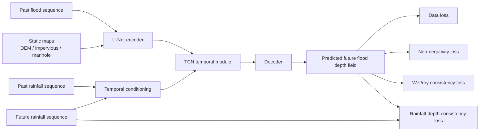
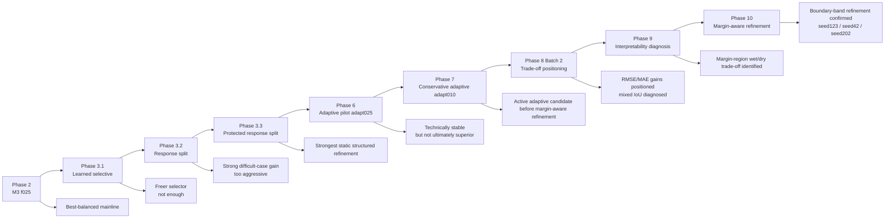
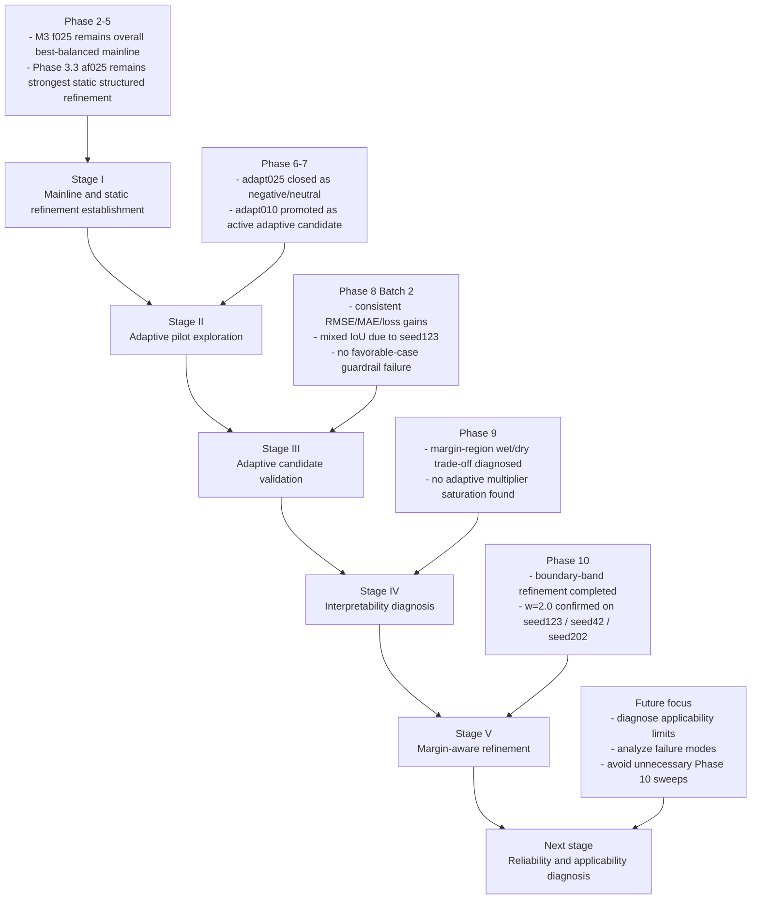

# Physics-Guided Urban Flood Process Prediction

A research prototype for physics-guided urban flood process prediction based on a U-Net + TCN framework.

## Method Diagram



## Stage Evolution




## Overview

This repository implements a spatiotemporal urban flood forecasting prototype using the UrbanFlood24 Lite dataset.  
The baseline model is built on a U-Net + TCN architecture for multi-step flood process prediction.

On top of the baseline, a Phase 1 physics-guided model is implemented by adding two output-space regularization terms:

- Non-negativity loss
- Wet/dry consistency loss

These physics-guided losses are imposed on the predicted future flood depth field at the output layer, while the backbone architecture remains unchanged.

## Current Mainline

The current overall best-balanced architecture reference is:

- `temporal_gate_residual_partial`
- `hidden_channels = 16`
- `residual_alpha = 0.10`
- `conditioned_fraction = 0.25`

This configuration remains the M3 `f025` mainline reference.

The strongest static structured refinement discovered so far is:

- `temporal_gate_residual_response_split_protected`
- `hidden_channels = 16`
- `residual_alpha = 0.10`
- `conditioned_fraction = 0.25`
- `active_fraction_within_response = 0.25`

This configuration remains the Phase 3.3 `af025` static reference.

Phase 6 Pilot A added an optional bounded adaptive scalar on top of the protected response-split path. The mechanism was technically stable, but the `adapt025` setting did not beat the static Phase 3.3 `af025` control in final validation, so it is treated as a documented negative/neutral adaptive result.

Phase 7 and Phase 8 established the more conservative `adapt010` setting as the active adaptive candidate before margin-aware refinement. It showed consistent RMSE, MAE, and loss gains across the required full `40e` comparisons, but Phase 8 also exposed a mixed wet/dry IoU trade-off, mainly through `seed123`.

Phase 9 diagnosed that trade-off as a mixed, margin-region, step-dependent wet/dry issue rather than adaptive multiplier saturation or seed-specific mechanism instability.

Phase 10 introduced a minimal diagnosis-driven intervention: boundary-band weighted wet/dry consistency refinement. The recommended Phase 10 setting is:

- `boundary_band_pixels = 1`
- `boundary_weight = 2.0`

This setting passed test-facing confirmation across the three key seeds:

- `seed123`: original mixed-IoU problem seed
- `seed42`: favorable-case guardrail seed
- `seed202`: difficult-case confirmation seed

`boundary_weight = 1.5` remains only a conservative rollback setting. No broader Phase 10 boundary-weight sweep is justified at this point.


## Historical Qualitative Examples

The figures below are earlier-stage qualitative comparisons retained for visual reference. They are not the only current evidence for the project state; the current project state is summarized above through Phase 10 margin-aware refinement.

### Baseline vs Phase 1

#### Spatial Inundation Comparison


#### Region-Averaged Process Comparison


### Phase 2A vs Phase 2B h16 on Difficult Case (`seed202`)

#### Spatial Inundation Comparison


#### Region-Averaged Process Comparison


## More Qualitative Figures

<details>
<summary>Expand additional favorable-case comparisons</summary>

### Phase 2A vs Phase 2B h16 on Favorable Case (`seed42`)

#### Spatial Inundation Comparison


#### Region-Averaged Process Comparison


</details>


## Research Roadmap




## Documentation

For the current staged experiment record, see:

- `docs/project_status.md`
- `docs/experiment_index.md`
- `docs/phase6_pilot_a_results.md`
- `docs/phase7_adapt010_results.md`
- `docs/phase8_batch1_results.md`
- `docs/phase8_tradeoff_positioning.md`
- `docs/phase9_interpretability_findings.md`
- `docs/phase10_margin_aware_findings.md`


## Dataset

This project uses the **UrbanFlood24 Lite** dataset.

Expected dataset directory:

```text
data/
  urbanflood24_lite/
    train/
    test/
```

The dataset includes:

- dynamic flood depth sequences: `flood.npy`
- rainfall forcing sequences: `rainfall.npy`
- static geospatial factors:
  - `absolute_DEM.npy`
  - `impervious.npy`
  - `manhole.npy`


## Task Definition

This project studies **multi-step flood process prediction**.

### Inputs

- past flood sequence
- past rainfall sequence
- future rainfall sequence
- static maps

### Output

- future flood depth sequence

In the current setup, the model uses:

- `input_steps = 12`
- `pred_steps = 12`


## Method

### Backbone

The forecasting backbone is based on a U-Net + TCN style spatiotemporal model.

### Physics-guided strategy

This repository currently has:

- a stable baseline built on U-Net + TCN
- stable physics guidance from non-negativity loss and wet/dry consistency loss
- optional architecture-level rainfall conditioning modules used for staged research experiments

### Stable baseline

The stable baseline path keeps the backbone unchanged and preserves the two stable physics-guided losses:

- non-negativity loss
- wet/dry consistency loss

### Optional rainfall conditioning

Architecture-level rainfall conditioning remains optional and config-driven. Existing training scripts and configs remain usable when the `rainfall_conditioning` block is omitted or disabled.

## Environment

Example setup:

```bash
conda create -n your_env_name python=3.8 -y
conda activate your_env_name
pip install -r requirements.txt
```

## Training

The current main training entry is:

```bash
python scripts/train_model.py --config <config_path>
```

### Example: stable loss-guided baseline (40 epochs, seed42)

```bash
python scripts/train_model.py --config configs/train_phase2_loss_only_40e_seed42.json
```

### Example: M3 mainline reference (40 epochs, seed42)

```bash
python scripts/train_model.py --config configs/train_phase2b_temporal_gate_h16_40e_seed42.json
```

### Example: Phase 3.3 protected response-split control (40 epochs, seed42)

```bash
python scripts/train_model.py --config configs/train_phase3_3_temporal_gate_residual_response_split_protected_h16_a010_f025_af025_40e_seed42.json
```

### Example: Phase 6 Pilot A adaptive scalar variant (5 epochs, seed42)

```bash
python scripts/train_model.py --config configs/train_phase6_pilot_a_temporal_gate_residual_response_split_protected_h16_a010_f025_af025_adapt025_5e_seed42.json
```

### Example: Phase 8 adaptive candidate validation (40 epochs, seed42)

```bash
python scripts/train_model.py --config configs/train_phase8_validation_temporal_gate_residual_response_split_protected_h16_a010_f025_af025_adapt010_40e_seed42.json
```

### Example: debug run

```bash
python scripts/train_model.py --config configs/train_phase2b_temporal_gate_debug.json
```

Additional experiment settings are provided under `configs/`.


## Evaluation and Visualization

Current evaluation combines staged validation metrics with paired qualitative checks. The comparison scripts remain useful for inspecting representative cases and historical visual outputs:

```bash
python compare_maps.py
python compare_timeseries.py
```

These scripts are used for paired qualitative comparison on representative cases such as `seed42`, `seed202`, and `seed123`, while Phase 10 provides the current margin-aware refinement evidence.

Generated figures are organized under:

- `docs/figures/phase2_qualitative/`


## Current Project Status

The repository has completed the main Phase 2-3 architecture comparison cycle, closed the Phase 6 `adapt025` pilot as negative/neutral, established Phase 7/8 `adapt010` as the active adaptive candidate before margin-aware refinement, completed Phase 9 interpretability diagnosis, and completed the Phase 10 margin-aware refinement intervention.

Current project-level conclusions:

- **M3 `f025` remains the overall best-balanced mainline reference**
- **Phase 3.3 `af025` remains the strongest static structured refinement**
- **Phase 6 Pilot A `adapt025` is closed as a negative/neutral result**
- **Phase 7/8 `adapt010` remains the active adaptive candidate before margin-aware refinement**
- **Phase 9 diagnosed the key wet/dry IoU issue as a mixed, margin-region, step-dependent trade-off**
- **Phase 10 boundary-band weighted wet/dry consistency refinement is the current recommended margin-aware setting**
- **Recommended Phase 10 setting: `boundary_band_pixels = 1`, `boundary_weight = 2.0`**
- **This setting passed test-facing confirmation on `seed123`, `seed42`, and `seed202`**

At this stage, the project focus should move from Phase 10 tuning to mainline consolidation and reliability/applicability diagnosis. No broader Phase 10 boundary-weight sweep is justified.

## Representative Case Framing

Three representative cases continue to be useful for targeted comparison:

- `seed42`: favorable-case reference where stronger structured refinement must avoid unnecessary damage
- `seed202`: difficult-case reference where stronger structured refinement can show useful gains
- `seed123`: repeatability reference for checking whether candidate behavior generalizes beyond the two anchor cases

This framing motivated the Phase 6 Pilot A test, the Phase 7 conservative `adapt010` follow-up, the Phase 9 diagnosis, and the Phase 10 margin-aware boundary-band refinement.


## Adaptive Candidate and Margin-Aware Refinement

Phase 6 Pilot A kept the protected response-split path and added an optional bounded adaptive scalar. The earlier `adapt025` setting was technically stable, but it is now closed as a negative/neutral result:

```json
"rainfall_conditioning": {
  "enabled": true,
  "mode": "temporal_gate_residual_response_split_protected",
  "hidden_channels": 16,
  "residual_alpha": 0.10,
  "conditioned_fraction": 0.25,
  "active_fraction_within_response": 0.25,
  "adaptive_alpha_enabled": true,
  "adaptive_alpha_range": 0.25
}
```

The active adaptive candidate before margin-aware refinement is the more conservative Phase 7/Phase 8 `adapt010` setting:

```json
"rainfall_conditioning": {
  "enabled": true,
  "mode": "temporal_gate_residual_response_split_protected",
  "hidden_channels": 16,
  "residual_alpha": 0.10,
  "conditioned_fraction": 0.25,
  "active_fraction_within_response": 0.25,
  "adaptive_alpha_enabled": true,
  "adaptive_alpha_range": 0.10
}
```

When `adaptive_alpha_enabled` is omitted or set to `false`, the model falls back to the static protected response-split behavior. This keeps the adaptive addition optional and backward compatible with existing configs while preserving Phase 3.3 `af025` as the strongest static structured refinement.

Phase 10 keeps this adaptive structure and adds a margin-aware wet/dry consistency refinement. The recommended Phase 10 setting is:

```json
"wet_dry_consistency": {
  "enabled": true,
  "weight": 0.05,
  "threshold": 0.05,
  "temperature": 0.02,
  "boundary_band_pixels": 1,
  "boundary_weight": 2.0
}
```

This boundary-band setting has passed test-facing confirmation across `seed123`, `seed42`, and `seed202`. `boundary_weight = 1.5` is retained only as a conservative rollback setting.

## Future Work

The next justified follow-up is not another Phase 10 boundary-weight sweep. The current recommended setting is `boundary_band_pixels = 1` and `boundary_weight = 2.0`.

Recommended next work:

- consolidate the Phase 10 result into the project mainline
- keep `boundary_weight = 1.5` only as a conservative rollback setting
- avoid new boundary-weight sweeps unless a new diagnosis clearly justifies them
- start a reliability/applicability diagnosis phase focused on where the model is reliable, where it fails, and how performance changes across rainfall intensity, time step, water-depth range, and wet/dry boundary distance

## License

MIT License.
