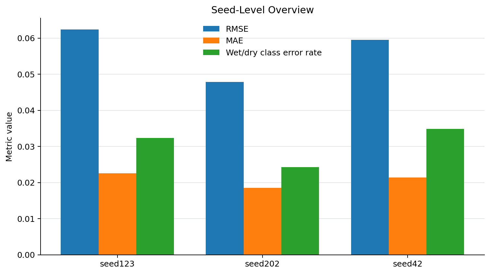
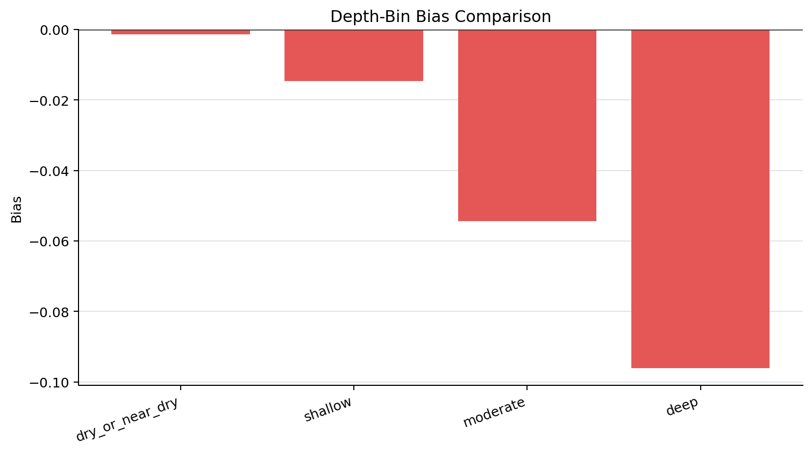
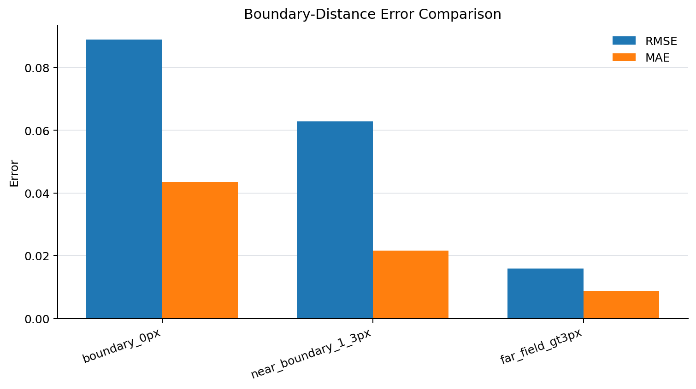

# Phase 12 Reliability / Applicability Findings

## Purpose

Phase 12 evaluates the reliability and applicability boundaries of the current Phase 10 recommended model. The goal is not to tune the model further, but to diagnose where the model is reliable, where it is less reliable, and how its errors vary across forecast timesteps, target water-depth ranges, wet/dry boundary-distance bands, scenarios, and seeds.

The diagnostic object is the Phase 10 recommended margin-aware setting:

- `boundary_band_pixels = 1`
- `boundary_weight = 2.0`

The analysis uses saved test-facing forecast maps from the following runs:

- `runs/phase10_margin_aware_boundary_band_seed123_40e`
- `runs/phase10_margin_aware_boundary_band_seed42_40e`
- `runs/phase10_margin_aware_boundary_band_seed202_40e`

The Phase 12 diagnostic script used 57 saved `evaluation_test/test_batch_*/forecast_maps.npz` batches. No retraining, architecture modification, Phase 10 loss modification, boundary-weight tuning, or new sweep was performed.

## Important Metric Interpretation Note

The Phase 12 metrics are pooled diagnostic metrics recomputed from saved forecast maps. They are intended for reliability profiling across timesteps, depth bins, boundary-distance bands, scenarios, and failure cases.

They should not be treated as replacements for the official `evaluation_test/metrics.json` values produced by the standard evaluation script.

Small differences between Phase 12 pooled diagnostic metrics and official evaluation metrics are expected because the aggregation logic is different. The official metrics remain the reference values for reporting test performance, while the Phase 12 metrics are used to diagnose where errors occur.

## Overall Reliability Summary

Across the three Phase 10 recommended runs, the pooled Phase 12 diagnostic metrics were:

- RMSE: 0.056963
- MAE: 0.020818
- Bias: -0.007694
- Wet/dry IoU: 0.760487
- Wet/dry classification error rate: 0.030526
- Predicted wet fraction: 0.108248
- Target wet fraction: 0.116124

The negative bias indicates a mild overall underprediction tendency. This is also reflected by the lower predicted wet fraction compared with the target wet fraction.

Across seeds, the pooled diagnostic metrics were:

| Seed | RMSE | MAE | Bias | Wet/dry IoU | Wet/dry class error rate |
|---|---:|---:|---:|---:|---:|
| seed123 | 0.062438 | 0.022525 | -0.007889 | 0.746987 | 0.032377 |
| seed42 | 0.059527 | 0.021415 | -0.008547 | 0.728159 | 0.034898 |
| seed202 | 0.047879 | 0.018512 | -0.006647 | 0.807135 | 0.024302 |

In the Phase 12 pooled diagnostic view, `seed202` is the most reliable of the three seeds, while `seed42` has the lowest wet/dry IoU and highest wet/dry classification error rate. `seed123` has the highest RMSE among the three.

### Seed-Level Diagnostic Figure

This figure summarizes the seed-level diagnostic metrics. In the pooled Phase 12 diagnostic view, `seed202` shows the lowest RMSE and MAE, while `seed42` has the highest wet/dry classification error rate.

## Timestep Reliability

The aggregate timestep metrics show that error does not simply increase with forecast horizon.

For the aggregate pooled results:

- Step 0 RMSE: 0.077199
- Step 1 RMSE: 0.070444
- Step 2 RMSE: 0.063526
- Step 3 RMSE: 0.059295
- Step 4 RMSE: 0.058509
- Step 5 RMSE: 0.056757
- Step 6 RMSE: 0.050249
- Step 7 RMSE: 0.047976
- Step 8 RMSE: 0.044194

The early forecast steps show larger errors, while later listed steps show lower RMSE and generally improved wet/dry IoU. This means the current model failure pattern cannot be summarized as a simple rollout degradation problem.

A likely interpretation is that the difficulty depends on the event phase and target wet fraction rather than only on forecast lead time. Early prediction windows may include sharper transitions, stronger initial mismatch, or more dynamic wet/dry evolution.

### Timestep Diagnostic Figure

This figure shows that aggregate RMSE and MAE do not monotonically increase with forecast lead time. The larger errors appear in the early forecast steps, while later steps show lower aggregate RMSE. This supports the interpretation that the reliability pattern is not a simple rollout-degradation problem.

## Depth-Bin Reliability

Depth-bin diagnostics show a clear depth-dependent error structure.

Aggregate pooled metrics by target depth bin were:

| Depth bin | RMSE | MAE | Bias | Wet/dry class error rate |
|---|---:|---:|---:|---:|
| dry / near dry, target <= 0.05 | 0.014865 | 0.010240 | -0.001390 | 0.012812 |
| shallow, 0.05 < target <= 0.15 | 0.055090 | 0.041632 | -0.014595 | 0.350521 |
| moderate, 0.15 < target <= 0.30 | 0.110494 | 0.089882 | -0.054312 | 0.106058 |
| deep, target > 0.30 | 0.238304 | 0.165584 | -0.096158 | 0.020596 |

The largest absolute errors occur in the deep-water bin. The deep and moderate bins both show substantial negative bias, indicating that the model tends to underpredict larger water depths.

The shallow bin has a lower absolute RMSE than the moderate and deep bins, but it has a high wet/dry classification error rate. This is expected because shallow cells are close to the wet/dry threshold and are therefore sensitive to small depth errors.

The dry / near-dry bin has low RMSE and MAE, but wet/dry IoU in this bin should not be over-interpreted because the target wet fraction is zero by definition for this bin.

### Depth-Bin Diagnostic Figures

These figures show that absolute error increases substantially from dry or near-dry cells to shallow, moderate, and deep water-depth bins. The bias comparison also shows a consistent negative bias, especially in moderate and deep cells, indicating systematic underprediction for larger inundation depths.

## Boundary-Distance Reliability

Boundary-distance diagnostics strongly support the importance of wet/dry transition regions.

Aggregate pooled metrics were:

| Boundary-distance band | RMSE | MAE | Bias | Wet/dry IoU | Wet/dry class error rate |
|---|---:|---:|---:|---:|---:|
| boundary 0 px | 0.088979 | 0.043445 | -0.019517 | 0.685699 | 0.132940 |
| near boundary 1–3 px | 0.062837 | 0.021680 | -0.007544 | 0.916616 | 0.008254 |
| far field > 3 px | 0.015907 | 0.008796 | -0.001996 | 0.834343 | 0.001482 |

The target wet/dry boundary band remains the most difficult region. It has the highest RMSE, highest MAE, largest negative bias, and highest wet/dry classification error rate.

The near-boundary 1–3 px band performs substantially better than the exact boundary band. The far-field region has very low error and very low classification error.

This confirms that the model is most reliable away from active wet/dry transition cells, while the immediate target wet/dry boundary remains the main reliability bottleneck.

This finding is consistent with the motivation of Phase 10. Phase 10 improved the margin-aware treatment of the wet/dry boundary, but Phase 12 shows that the exact boundary band remains the most error-prone area and should be reported as a caution zone.

### Boundary-Distance Diagnostic Figures

These figures confirm that the exact target wet/dry boundary band remains the most difficult region. Both regression error and wet/dry classification error are highest at `boundary_0px`, while the far-field region has much lower error.

## Scenario And Failure-Case Reliability

The highest-ranked failure cases are concentrated in `location2` and high-return-period rainfall events, especially:

- `r300y_p0.6_d3h`
- `r300y_p0.8_d3h`
- `r200y_p0.5_d3h`

Top failure cases show a consistent underprediction pattern. For example:

- Failure rank 1: `seed42`, `location2`, `r300y_p0.6_d3h`
  - RMSE: 0.103258
  - Bias: -0.020019
  - Wet/dry IoU: 0.464716
  - Target mean depth: 0.028809
  - Prediction mean depth: 0.008790

- Failure rank 3: `seed42`, `location2`, `r300y_p0.8_d3h`
  - RMSE: 0.099551
  - Bias: -0.019032
  - Wet/dry IoU: 0.401012
  - Target mean depth: 0.027899
  - Prediction mean depth: 0.008866

These cases indicate that the current model is less reliable for certain high-intensity `location2` scenarios where the target contains localized high depths but the prediction underestimates both mean inundation depth and wet extent.

### Failure-Case Diagnostic Figure

The highest-ranked failure cases are concentrated in `location2` and high-return-period rainfall scenarios, especially `r300y_p0.6_d3h`, `r300y_p0.8_d3h`, and `r200y_p0.5_d3h`. This supports the finding that the current model should be used cautiously for high-intensity localized failure cases.

## Applicability Interpretation

The current Phase 10 recommended model is reliable for general spatiotemporal flood-pattern prediction under the tested UrbanFlood24 Lite scenarios, especially when evaluated away from exact wet/dry transition cells and outside the most difficult high-intensity failure cases.

The model is most reliable in:

- far-field regions more than 3 pixels away from target wet/dry boundaries
- dry or near-dry areas in terms of absolute depth error
- the seed202 diagnostic run among the three tested seeds
- general aggregate performance across the three Phase 10 confirmed seeds

The model requires more caution in:

- exact wet/dry boundary cells
- shallow near-threshold cells where classification is sensitive
- moderate and deep water-depth bins where underprediction becomes stronger
- high-intensity `location2` scenarios such as `r300y_p0.6_d3h` and `r300y_p0.8_d3h`
- local peak-depth interpretation, because failure cases show substantial underprediction of large local maxima

## Reliability Boundaries

Based on the Phase 12 diagnostics, the current reliability boundary can be stated as follows:

The Phase 10 recommended model is suitable for rapid, spatially distributed flood-process approximation and general wet/dry pattern estimation under the tested scenario set. However, it should not be interpreted as equally reliable for every pixel, depth range, and scenario condition.

The main caution zones are:

1. Exact wet/dry boundary cells
2. Shallow threshold-adjacent areas
3. Moderate-to-deep inundation depths
4. High-intensity `location2` scenarios
5. Local peak-depth extremes

These are not reasons to reopen Phase 10 tuning immediately. Instead, they define where future diagnostics, visualization, uncertainty estimation, or targeted model improvements should focus.

## Limitations

This Phase 12 analysis is based on saved test-facing forecast maps from the three Phase 10 recommended runs. It does not establish external-dataset generalization.

The diagnostic metrics are pooled from saved forecast maps and may differ from official evaluation metrics because of aggregation differences. Official `evaluation_test/metrics.json` values should remain the reference for reporting test performance.

The rainfall-condition diagnosis is currently based on available scenario metadata such as location, event, start index, target wet fraction, target depth statistics, and failure-case ranking. A more explicit rainfall-intensity grouping could be added in a later phase if rainfall time-series metadata are incorporated directly into the diagnostic output.

The current analysis identifies reliability patterns, but it does not yet provide uncertainty intervals or probabilistic confidence estimates.

## Next Step

The next step is to review this findings document against the generated CSV and JSON outputs, then commit it as the first Phase 12 reliability/applicability interpretation.

After that, a narrow follow-up may add diagnostic figures or representative failure-case visual summaries, but no model retraining or Phase 10 boundary-weight sweep is justified by this first findings pass.