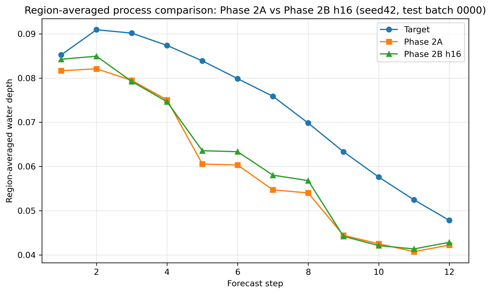

\# Phase 2 Qualitative Comparison Notes

\## Scope

This note provides a paired qualitative comparison between:

\- Phase 2A (loss-only baseline)

\- Phase 2B h16 (rainfall-conditioned temporal gate)

using two representative test cases:

\- \*\*seed42\*\*: a case where the overall test metrics favor \*\*Phase 2B h16\*\*

\- \*\*seed202\*\*: a case where the overall test metrics favor \*\*Phase 2A\*\*

The goal is to complement the multi-seed validation/test summary with direct visual evidence from:

\- spatial inundation maps

\- region-averaged process curves

\---

\## Case 1: seed42

### Figures

**Spatial comparison**

**Region-averaged process comparison**

\### Overall interpretation

For \*\*seed42\*\*, both the quantitative test metrics and the qualitative visual comparison support \*\*Phase 2B h16\*\*.

\### Spatial inundation map comparison

The spatial map comparison indicates that \*\*Phase 2B h16\*\* is visually closer to the target pattern.

Main observations:

\- In the upper main wet region and around the central high-value ring, \*\*Phase 2B h16\*\* better matches the target spatial structure.

\- The \*\*Phase 2B h16 error map\*\* is overall darker than the \*\*Phase 2A error map\*\*, suggesting lower spatial reconstruction error.

\- In the middle and lower scattered wet patches, Phase 2B h16 also shows slightly lighter and less extensive errors.

Overall, the spatial comparison for seed42 favors \*\*Phase 2B h16\*\*.

\### Region-averaged process comparison

The region-averaged process curve also supports \*\*Phase 2B h16\*\*.

Main observations:

\- Over forecast steps 1–8, the Phase 2B h16 curve stays closer to the target than the Phase 2A curve for most steps.

\- In the later forecast range (roughly steps 9–12), the gap becomes smaller, but Phase 2B h16 still remains slightly closer overall.

Overall, the time-series comparison for seed42 also favors \*\*Phase 2B h16\*\*.

\### Seed42 conclusion

For \*\*seed42\*\*, the qualitative and quantitative conclusions are aligned:

\- the test metrics favor \*\*Phase 2B h16\*\*

\- the inundation map comparison favors \*\*Phase 2B h16\*\*

\- the region-averaged process comparison also favors \*\*Phase 2B h16\*\*

This is therefore a representative case showing that the rainfall-conditioned temporal gate can produce genuinely improved predictions, not just marginal metric fluctuations.

\---

\## Case 2: seed202

### Figures

**Spatial comparison**

**Region-averaged process comparison**

\### Overall interpretation

For \*\*seed202\*\*, the qualitative comparison is more mixed, but the overall evidence still supports \*\*Phase 2A\*\*, especially from the spatial side and the full test summary.

\### Spatial inundation map comparison

The spatial inundation maps clearly favor \*\*Phase 2A\*\*.

Main observations:

\- The \*\*Phase 2A error map\*\* appears cleaner overall than the \*\*Phase 2B h16 error map\*\*.

\- The \*\*Phase 2B h16 error map\*\* contains more bright residuals in the middle region, lower-right area, and around finer branch-like wet structures.

\- Along wet/dry boundaries, \*\*Phase 2A\*\* appears more stable and compact, whereas \*\*Phase 2B h16\*\* is somewhat more scattered.

Overall, the spatial comparison for seed202 favors \*\*Phase 2A\*\*.

\### Region-averaged process comparison

The region-averaged process curve for seed202 is less one-sided than the spatial map comparison.

Main observations:

\- After approximately step 2, the Phase 2B h16 curve is often as good as or slightly closer to the target than the Phase 2A curve.

\- In the middle-to-late forecast range, the process comparison looks mixed rather than decisively favoring Phase 2A.

\- In some local intervals, the process curve even appears to slightly favor \*\*Phase 2B h16\*\*.

Overall, the time-series comparison for seed202 should be described as \*\*mixed\*\*, with some local behavior favoring \*\*Phase 2B h16\*\*.

\### Seed202 conclusion

For \*\*seed202\*\*, the most accurate interpretation is:

\- the spatial inundation maps favor \*\*Phase 2A\*\*

\- the full test metrics favor \*\*Phase 2A\*\*

\- the single-batch region-averaged process curve is \*\*mixed\*\*, with some local portions slightly favoring \*\*Phase 2B h16\*\*

This means seed202 should not be described as a case where every visual signal supports Phase 2A. Instead, it is a case where \*\*Phase 2A is stronger overall\*\*, but \*\*Phase 2B h16 still shows some local temporal advantages\*\* on a representative sample.

\---

\## Cross-case takeaway

These qualitative comparisons support a more mature and balanced phase conclusion:

\- \*\*Phase 2B h16\*\* is genuinely stronger on some cases, and its gains are visible both in metrics and in representative plots.

\- \*\*Phase 2A\*\* remains the more stable choice overall, especially in spatial reconstruction quality and in the broader multi-seed test summary.

\- Therefore, the current project conclusion remains well justified:

&#x20; - \*\*Primary candidate: Phase 2A 40e\*\*

&#x20; - \*\*Strong alternative: Phase 2B h16 40e\*\*

\---

\## Note for figure title cleanup

One minor formatting issue remains for the process comparison figures.

The current titles should be updated to include explicit seed and batch identifiers, for example:

\- `Region-averaged process comparison: Phase 2A vs Phase 2B h16 (seed42, test batch 0000)`

\- `Region-averaged process comparison: Phase 2A vs Phase 2B h16 (seed202, test batch 0000)`

This would make the qualitative figures more self-contained for future reporting, README updates, or experiment summaries.

