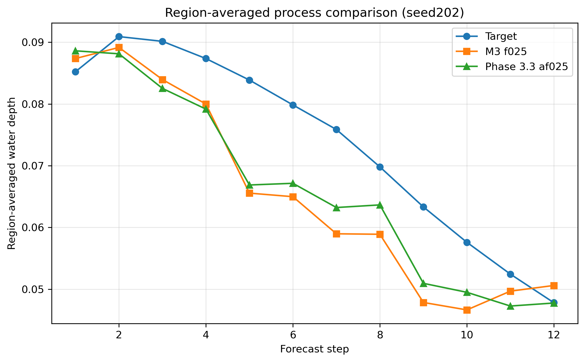
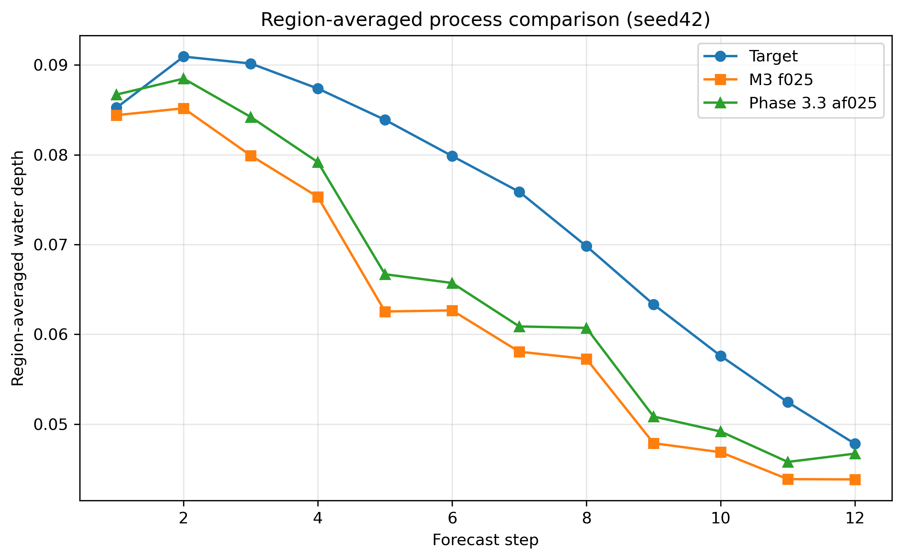

# Phase 4 Final Comparison

## Goal

Compare the two final contender directions:

- M3 f025
- Phase 3.3 af025

This phase is intended to consolidate the final project-level conclusion rather than introduce new architecture changes.

## Final Contenders

### Contender A: M3 f025

- mode: `temporal_gate_residual_partial`
- hidden_channels = 16
- residual_alpha = 0.10
- conditioned_fraction = 0.25

### Contender B: Phase 3.3 af025

- mode: `temporal_gate_residual_response_split_protected`
- hidden_channels = 16
- residual_alpha = 0.10
- conditioned_fraction = 0.25
- active_fraction_within_response = 0.25

## Quantitative Summary

| Variant | Seed202 RMSE | Seed202 MAE | Seed202 IoU | Seed202 Stability | Seed42 RMSE | Seed42 MAE | Seed42 IoU | Seed42 Stability |
|---|---:|---:|---:|---:|---:|---:|---:|---:|
| M3 f025 | 0.040568 | 0.016056 | 0.795732 | 0.990637 | 0.035211 | 0.013695 | 0.830558 | 0.991363 |
| Phase 3.3 af025 | 0.039514 | 0.015807 | 0.801322 | 0.991308 | 0.038861 | 0.014598 | 0.800325 | 0.991591 |

## Seed202 Final Comparison

### Spatial comparison

### Process comparison

### Reading

- Phase 3.3 af025 performs better on the difficult case.
- Improvements are reflected in RMSE, MAE, IoU, and rollout stability.
- This confirms that protected structured modulation helps difficult-case behavior.

## Seed42 Final Comparison

### Spatial comparison

### Process comparison

### Reading

- M3 f025 remains stronger on the favorable case.
- Phase 3.3 af025 improves structural interpretability, but still sacrifices too much favorable-case accuracy.
- This explains why Phase 3.3 af025 does not replace M3 as the overall best-balanced architecture.

## Final Project-Level Conclusion

The final comparison supports the following project-level conclusion:

- **M3 f025 remains the current best-balanced architecture**
- **Phase 3.3 af025 is the strongest structured refinement discovered so far**

This means the structured refinement direction is valid and meaningful, especially for difficult cases, but it has not yet fully surpassed the current M3 mainline in cross-seed balance.

## Recommended Positioning

- Keep M3 f025 as the current mainline reference
- Preserve Phase 3.3 af025 as the strongest structured refinement archive
- Treat Phase 4 as the final consolidation stage of the current project cycle